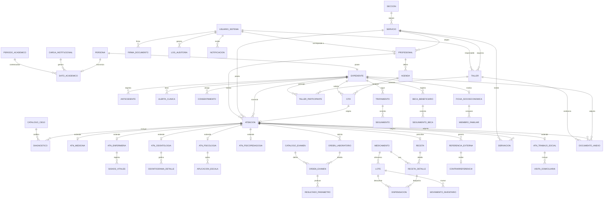

# INFORME TÉCNICO
# Sistema Integral de Bienestar Universitario (SIBU)

**Documento base para análisis, diseño y desarrollo de software**

| Campo | Detalle |
|---|---|
| Proyecto | Sistema Web Institucional para la Administración Integral de la Unidad de Bienestar Universitario |
| Institución | **Universidad Nacional de Loja (UNL)** |
| Nombre del sistema | **Sistema Integral de Bienestar Universitario (SIBU)** |
| Tipo de documento | Informe técnico – Especificación funcional y propuesta de arquitectura |
| Versión | 1.1 |
| Fecha | Julio 2026 |
| Audiencia | Dirección de Bienestar Universitario, Dirección de TIC, equipo de desarrollo (incluido análisis asistido por IA) |
| Stack tecnológico definido | Python + Django, Django REST Framework, PostgreSQL, HTML5/CSS3/JavaScript + Bootstrap 5 |
| Entorno de desarrollo | GitHub Codespaces (cuenta educativa) → continuidad en macOS (Intel) con dev containers |

**Control de cambios**

| Versión | Cambios principales |
|---|---|
| 1.0 | Versión inicial genérica para IES |
| 1.1 | Adaptación a la UNL: (a) la base institucional proviene de la **ficha socioeconómica digital de matrícula** cargada en **Excel/CSV** cada período (integración API con el SGA pasa a fase 2); (b) **Becas** se limita en fase 1 a gestión/visualización de beneficiarios y registro de seguimiento (el ciclo convocatoria–adjudicación se integrará con el sistema existente); (c) Laboratorio envía resultados también al **correo institucional del estudiante**; (d) nuevo módulo de **Talleres** (Psicopedagogía, Trabajo Social y Salud si el administrador lo habilita) con nómina digital y evidencias archivadas en **Google Drive institucional**; (e) entorno de desarrollo definido: Codespaces + macOS Intel (Anexo D) |

---

## Tabla de contenido

1. Resumen ejecutivo
2. Objetivos y alcance
3. Contexto y estructura organizacional
4. Arquitectura funcional y de software
5. Módulos del sistema
6. Formatos de atención y fichas por especialidad
7. Integración con la base de datos institucional
8. Requerimientos funcionales (RF)
9. Requerimientos no funcionales (RNF)
10. Roles, perfiles y matriz de permisos (RBAC)
11. Modelo de datos y modelo entidad–relación
12. Flujos de trabajo (procesos)
13. Casos de uso
14. Seguridad informática
15. Reportes, indicadores y tableros de control
16. Propuesta tecnológica de implementación
17. Cronograma de desarrollo
18. Recomendaciones técnicas y de implementación
19. Anexos

---

# 1. Resumen ejecutivo

El presente documento especifica el diseño funcional y técnico del **Sistema Integral de Bienestar Universitario (SIBU)**, una plataforma web institucional destinada a administrar de forma unificada los servicios de la Unidad de Bienestar Universitario de la **Universidad Nacional de Loja (UNL)**: **Medicina, Enfermería, Odontología, Laboratorio Clínico, Farmacia, Psicología, Psicopedagogía, Trabajo Social y Becas**.

El sistema centraliza la historia clínica y las fichas de atención de cada servicio bajo un **expediente único por usuario** (identificado por número de cédula), se alimenta de la **base de datos institucional generada por la ficha socioeconómica digital** que los estudiantes completan al matricularse cada período académico —cargada al sistema en formato **Excel/CSV**, con integración futura vía API/vistas al SGA— y soporta procesos transversales: agendamiento de citas, derivación interna entre servicios, referencia y contrarreferencia externa, solicitud y resultado de exámenes de laboratorio, prescripción y despacho farmacéutico con control de inventario, seguimiento de tratamientos, gestión documental, notificaciones, firma digital de profesionales, auditoría completa y generación automática de reportes e indicadores institucionales (mensuales, semestrales, anuales, por servicio, por profesional, por facultad/carrera/período). En la fase inicial, el módulo de **Becas** se limita a la gestión, visualización y seguimiento de beneficiarios (el ciclo de convocatoria–postulación–adjudicación se integrará posteriormente con el sistema institucional existente), y se incorpora el **registro de talleres** con nómina digital de participantes y evidencias (fotografías y registro escaneado en PDF) archivadas automáticamente en el **Google Drive institucional** del responsable del servicio (Google Workspace).

La seguridad del sistema se diseña bajo el principio de que la información gestionada es **doblemente sensible** (datos de salud + datos académicos personales): autenticación robusta con MFA, RBAC granular, cifrado en tránsito y en reposo, registro de auditoría inmutable, respaldos y plan de recuperación ante desastres, y mitigación del OWASP Top 10, alineado a normativas de protección de datos personales y buenas prácticas para sistemas de información en salud (confidencialidad de la historia clínica, principio de mínimo privilegio, trazabilidad total).

La implementación se plantea exclusivamente sobre el stack: **Backend Python 3.12 + Django 5.x, API con Django REST Framework, base de datos PostgreSQL 16, frontend HTML5/CSS3/JavaScript con Bootstrap 5**, con componentes de soporte estándar del ecosistema (Gunicorn, Nginx, Celery + Redis para tareas asíncronas, Docker para despliegue).

---

# 2. Objetivos y alcance

## 2.1 Objetivo general

Diseñar y desarrollar un sistema web institucional que administre integralmente los servicios de la Unidad de Bienestar Universitario, garantizando un expediente único del usuario, interoperabilidad con la base académica institucional, trazabilidad clínica y administrativa completa, y generación automática de información estadística para la toma de decisiones y los procesos de acreditación institucional.

## 2.2 Objetivos específicos

1. Digitalizar los formatos de atención e historias clínicas/fichas de registro de los nueve servicios, respetando la estructura habitual de los formularios de instituciones de salud y educación superior.
2. Implementar un expediente único del usuario que consolide todas las atenciones, con acceso segmentado por servicio y rol.
3. Integrar la verificación automática de datos institucionales (matrícula, carrera, facultad, período, estado académico, tipo de vínculo) mediante el número de cédula.
4. Automatizar los flujos de citas, derivaciones internas, referencias/contrarreferencias, órdenes de laboratorio, recetas y despacho de farmacia.
5. Controlar el inventario farmacéutico (lotes, caducidades, stock mínimo, dispensación).
6. Proveer reportería automática e indicadores en tableros de control por múltiples dimensiones.
7. Garantizar seguridad, confidencialidad, integridad, disponibilidad y auditoría de la información.

## 2.3 Alcance funcional

**Incluye:** los 9 servicios listados, los 4 módulos seccionales, módulos transversales (usuarios, citas, expediente, derivaciones, documentos, notificaciones, firma, auditoría, reportes, administración), carga periódica de la base institucional desde archivos **Excel/CSV** provenientes de la ficha socioeconómica de matrícula, gestión de beneficiarios de becas con seguimiento, registro de talleres con archivo de evidencias en Google Drive institucional, envío de resultados de laboratorio al correo institucional, y portal de autogestión básica para el usuario final (agendar/consultar citas, ver notificaciones, descargar certificados de atención).

**No incluye (fase 1):** facturación/recaudación, telemedicina con video, interoperabilidad HL7/FHIR con la red pública de salud (se deja preparada la estructura de datos para una fase 2), historia laboral ocupacional completa (solo ficha básica del trabajador), app móvil nativa (el frontend será responsivo), **integración en línea con el SGA/ERP académico mediante API o vistas de base de datos** (aspecto escalable, fase 2: el diseño del módulo `academico` deja lista la interfaz), y el **ciclo completo de becas** —convocatorias, postulaciones, evaluación socioeconómica, comité, adjudicación y renovación—, que se integrará posteriormente con el sistema de becas ya construido por la institución.

## 2.4 Usuarios del sistema

- **Usuarios atendidos (pacientes/beneficiarios):** estudiantes, docentes, personal administrativo y trabajadores de la IES; opcionalmente familiares directos según política institucional.
- **Usuarios operadores:** profesionales de los 9 servicios, personal administrativo de la Unidad, personal de laboratorio y farmacia, coordinadores de sección, Director de la Unidad, Administrador General y perfiles de consulta restringida (autoridades, acreditación).

---

# 3. Contexto y estructura organizacional

La Unidad de Bienestar Universitario se organiza en cuatro secciones. El sistema replica esta jerarquía como estructura de datos (entidad `Seccion` → `Servicio`) y como base del modelo de permisos:

```
Dirección de la Unidad de Bienestar Universitario
│
├── Sección Salud
│   ├── Medicina
│   ├── Enfermería
│   ├── Odontología
│   ├── Laboratorio Clínico
│   └── Farmacia
│
├── Sección Psicopedagógica
│   ├── Psicología
│   └── Psicopedagogía
│
├── Sección Trabajo Social
│   └── Trabajo Social
│
└── Sección Becas
    └── Becas y Ayudas Económicas
```

**Implicaciones de diseño:**

- Cada **Coordinador de Sección** visualiza y gestiona únicamente los servicios de su sección (datos agregados y operativos), sin acceso al contenido clínico detallado de otras secciones.
- La **confidencialidad es asimétrica**: la información de Psicología es la más restringida (solo el profesional tratante y, con justificación registrada, el coordinador psicopedagógico); Trabajo Social maneja información socioeconómica sensible; Becas maneja información financiera. El RBAC (sección 10) formaliza estas restricciones.
- La estructura es **parametrizable**: secciones y servicios se administran como catálogos, permitiendo crear nuevos servicios sin cambios de código.

---

# 4. Arquitectura funcional y de software

## 4.1 Visión general (arquitectura por capas)

Se adopta una arquitectura **web monolítica modular** (Django apps desacopladas) con API REST interna, apropiada para el tamaño y equipo típico de un proyecto institucional, con posibilidad de evolucionar a servicios independientes.

```
┌─────────────────────────────────────────────────────────────────┐
│  CAPA DE PRESENTACIÓN                                           │
│  HTML5 + CSS3 + JavaScript (Bootstrap 5, Chart.js, HTMX/fetch)  │
│  · Portal profesional (escritorio clínico)                      │
│  · Portal administrativo y de dirección (tableros)              │
│  · Portal de autogestión del usuario (citas, notificaciones)    │
└───────────────▲─────────────────────────────────────────────────┘
                │ HTTPS / JSON
┌───────────────┴─────────────────────────────────────────────────┐
│  CAPA DE API                                                    │
│  Django REST Framework (versionada /api/v1/)                    │
│  · Autenticación (sesión + JWT), throttling, permisos DRF       │
└───────────────▲─────────────────────────────────────────────────┘
┌───────────────┴─────────────────────────────────────────────────┐
│  CAPA DE APLICACIÓN / NEGOCIO  (Django apps)                    │
│  core · usuarios · academico · citas · expediente ·             │
│  medicina · enfermeria · odontologia · laboratorio ·            │
│  farmacia · psicologia · psicopedagogia · trabajo_social ·      │
│  becas · derivaciones · documentos · notificaciones ·           │
│  firma · auditoria · reportes                                   │
├─────────────────────────────────────────────────────────────────┤
│  SERVICIOS TRANSVERSALES                                        │
│  Celery + Redis (tareas asíncronas: sincronización académica,   │
│  notificaciones, generación de reportes) · Almacenamiento de    │
│  archivos cifrado · Motor de firma digital · Logging/Auditoría  │
└───────────────▲─────────────────────────────────────────────────┘
┌───────────────┴─────────────────────────────────────────────────┐
│  CAPA DE DATOS                                                  │
│  PostgreSQL 16 (esquemas: core, clinico, academico_replica,     │
│  auditoria) · Réplica de lectura para reportes                  │
└───────────────▲─────────────────────────────────────────────────┘
                │ Carga Excel/CSV por período (fase 1) · API SGA (fase 2)
┌───────────────┴─────────────────────────────────────────────────┐
│  SISTEMAS EXTERNOS                                              │
│  · Ficha socioeconómica de matrícula (archivo Excel/CSV,        │
│    entregado cada período académico) — fuente primaria fase 1   │
│  · Sistema de Gestión Académica UNL (SGA/ERP) — API, fase 2     │
│  · Google Workspace institucional: Drive (evidencias de         │
│    talleres) y Gmail/SMTP (notificaciones y resultados de       │
│    laboratorio al correo institucional)                         │
│  · Sistema institucional de Becas existente — integración f. 2  │
│  · Directorio institucional / SSO (OAuth2/SAML)                 │
│  · Autoridad de certificación para firma digital                │
└─────────────────────────────────────────────────────────────────┘
```

## 4.2 Principios arquitectónicos

1. **Expediente único, registros por especialidad:** una entidad central `Persona/Expediente` con fichas especializadas por servicio (patrón "clase base + extensiones"), evitando duplicación de datos demográficos.
2. **Separación núcleo/servicios:** cada servicio es una Django app independiente que depende solo de `core`, `expediente` y `citas`; ningún servicio importa modelos de otro servicio (la comunicación entre servicios se hace vía `derivaciones` y `laboratorio/farmacia` como servicios de apoyo).
3. **Todo cambio es auditable:** middleware + señales que registran cada creación, lectura de historia clínica, modificación y eliminación lógica (no se permite borrado físico de registros clínicos).
4. **Inmutabilidad clínica:** las atenciones firmadas se vuelven de solo lectura; correcciones se realizan mediante notas de enmienda enlazadas.
5. **Datos institucionales de solo lectura:** la información institucional se consume de la carga oficial por período (Excel/CSV de la ficha socioeconómica); el sistema nunca la modifica; las correcciones se realizan re-cargando el archivo o mediante registro de novedad auditado.
6. **API-first:** toda funcionalidad se expone por API REST; el frontend consume la misma API, lo que facilita futura app móvil e integraciones.

## 4.3 Diagrama de contexto (nivel C4-1, descriptivo)

- **Actores:** paciente/beneficiario, profesional de servicio, personal administrativo, coordinador, director, administrador TI, sistemas externos (SGA, SSO, SMTP, CA de firma).
- **Sistema:** SIBU expone (a) portal web responsivo, (b) API REST v1, (c) tareas programadas de sincronización y reportería.

---

# 5. Módulos del sistema

## 5.1 Mapa de módulos

| # | Módulo (Django app) | Tipo | Descripción resumida |
|---|---|---|---|
| M01 | `core` | Transversal | Catálogos (secciones, servicios, períodos, CIE-10, CIF/DSM-5, cuadro básico de medicamentos, exámenes), parámetros institucionales |
| M02 | `usuarios` | Transversal | Cuentas, roles, permisos, autenticación, MFA, integración SSO/LDAP |
| M03 | `academico` | Integración | Carga y validación de la base institucional (ficha socioeconómica de matrícula, Excel/CSV) por período; consulta por cédula; interfaz preparada para API del SGA (fase 2) |
| M04 | `expediente` | Transversal | Expediente único, datos demográficos, antecedentes comunes, consentimientos informados |
| M05 | `citas` | Transversal | Agenda por profesional/servicio, disponibilidad, reserva, confirmación, reprogramación, ausentismo |
| M06 | `medicina` | Servicio | Historia clínica médica (anamnesis, examen físico, diagnóstico CIE-10, plan), evolución, certificados |
| M07 | `enfermeria` | Servicio | Ficha de enfermería, signos vitales, procedimientos, curaciones, inmunizaciones, triaje |
| M08 | `odontologia` | Servicio | Historia clínica odontológica, odontograma, plan de tratamiento por piezas, evolución |
| M09 | `laboratorio` | Apoyo | Órdenes de exámenes, toma de muestras, registro y validación de resultados, valores de referencia |
| M10 | `farmacia` | Apoyo | Recetas, despacho, inventario (lotes/caducidad), kárdex, stock mínimo, ajustes |
| M11 | `psicologia` | Servicio | Ficha psicológica, evaluación, plan terapéutico, sesiones, escalas, alerta de riesgo |
| M12 | `psicopedagogia` | Servicio | Ficha psicopedagógica, evaluación de aprendizaje, plan de intervención, seguimiento académico |
| M13 | `trabajo_social` | Servicio | Ficha socioeconómica, visitas domiciliarias, gestión de casos, informes sociales |
| M14 | `becas` | Servicio | Fase 1: registro/visualización de beneficiarios y seguimiento por período; fase 2: integración con el sistema de becas institucional existente |
| M15 | `derivaciones` | Transversal | Derivación interna entre servicios; referencia y contrarreferencia externa |
| M16 | `documentos` | Transversal | Gestión documental: anexos, plantillas, certificados, versionado; conector Google Drive institucional |
| M17 | `notificaciones` | Transversal | Recordatorios de citas, alertas de resultados, avisos por correo/SMS/in-app |
| M18 | `firma` | Transversal | Firma electrónica/digital de documentos clínicos y administrativos |
| M19 | `auditoria` | Transversal | Log inmutable de acciones (incluye lecturas de historia clínica) |
| M20 | `reportes` | Transversal | Reportería programada, indicadores, tableros, exportación PDF/XLSX/CSV |
| M21 | `talleres` | Transversal | Talleres y actividades grupales (Psicopedagogía y Trabajo Social; habilitable para Salud): datos del taller, nómina digital de participantes, fotografías y registro escaneado archivados en Google Drive institucional |

## 5.2 Descripción funcional por módulo (síntesis)

**M03 Académico (carga institucional):** en la fase 1 la fuente oficial es el **archivo Excel/CSV de la ficha socioeconómica** que los estudiantes completan al matricularse cada período. Un asistente de carga (solo Administrador o rol autorizado) ejecuta: subida del archivo → detección/mapeo de columnas contra la plantilla oficial (sección 7.3) → validación (cédulas con dígito verificador, correos institucionales, catálogos, duplicados) → previsualización con resumen de altas/cambios/errores → aplicación transaccional (upsert por cédula+período) → bitácora de carga descargable. Expone el servicio interno `consultar_persona(cedula)` que devuelve identificación, vínculo, facultad, carrera, nivel/ciclo, modalidad, jornada, paralelo, período, estado, correo institucional y teléfonos. Si la persona no existe, permite registro manual ("externo" o personal no incluido en la ficha). El módulo define una interfaz de proveedor de datos (`AcademicoProvider`) para que la futura integración por API/vistas con el SGA (fase 2) reemplace la carga manual sin tocar al resto del sistema.

**M05 Citas:** agendas configurables por profesional (horarios, duración de turno por tipo de atención, bloqueos por vacaciones/reuniones); reserva por personal administrativo o autogestión del usuario; estados: `reservada → confirmada → en_atencion → atendida | no_asistio | cancelada | reprogramada`; lista de espera; sobrecupo controlado; recordatorios automáticos T-48h y T-24h.

**M09 Laboratorio:** recibe órdenes solo desde Medicina y Odontología (regla de negocio); flujo: `orden_creada → muestra_tomada → en_proceso → resultado_registrado → validado → publicado`; catálogo de exámenes con valores de referencia por sexo/edad; resultados numéricos, cualitativos y por texto; alerta automática al profesional solicitante cuando el resultado es validado; **envío automático del informe de resultados en PDF firmado al correo institucional del estudiante/paciente** (dirección tomada de la base institucional cargada); marcación de valores críticos.

**M10 Farmacia:** recibe recetas electrónicas desde Medicina (y Odontología si la política lo permite); valida existencia y vigencia de la receta; despacho parcial o total con descuento automático de stock por lote (FEFO: primero en expirar, primero en salir); inventario con ingresos, egresos, ajustes, transferencias; alertas de stock mínimo y caducidad próxima (90/60/30 días); kárdex valorizado; reportes de consumo por medicamento, servicio y período.

**M14 Becas (alcance fase 1):** gestiona y visualiza **beneficiarios de becas** ya adjudicadas: registro individual o por carga masiva (Excel/CSV con cédulas, que se cruzan contra la base institucional), ficha del beneficiario (tipo de beca, período, monto/porcentaje, datos bancarios de la ficha socioeconómica —cifrados—, estado) y **registro de seguimiento por período** (observaciones, novedades, cumplimiento, entrevistas, articulación con Trabajo Social). El ciclo completo `convocatoria → postulación → verificación automática → evaluación socioeconómica → comité y adjudicación → notificación → renovación/terminación` **no se desarrolla en fase 1**: esas funciones se integrarán posteriormente con el **sistema de becas ya construido** por la institución; el modelo de datos y la API de SIBU quedan preparados para consumir/exponer esa información (sección 11).

**M21 Talleres:** disponible por defecto para **Psicopedagogía y Trabajo Social**, y habilitable para los servicios de la **Sección Salud** mediante parámetro del Administrador. Registra: datos del taller (tema, objetivo, servicio, responsable, fecha, lugar, duración, población objetivo), **nómina digital de participantes** construida seleccionando estudiantes de la base institucional (filtros por facultad/carrera/ciclo/paralelo) **o digitando números de cédula** (validados y autocompletados; los no encontrados quedan marcados para revisión), y **evidencias**: fotografías y el registro de asistencia escaneado (PDF). Las evidencias se suben automáticamente al **Google Drive institucional del responsable del servicio** (Google Workspace) en una estructura `SIBU/Talleres/<año>/<servicio>/<taller>/`; en la base de datos se guarda el `file_id`, el enlace y el hash SHA-256 para verificación (el binario no se duplica en el servidor, salvo caché temporal). Genera constancias de participación y alimenta los indicadores de actividades preventivas/promocionales.

**M15 Derivaciones:** cualquier profesional puede derivar un caso a otro servicio con motivo, resumen y prioridad; el servicio receptor la acepta y agenda; el sistema enlaza ambas atenciones y notifica el retorno de información (mini-contrarreferencia interna). Para referencias externas genera el formato institucional de referencia (a unidades de la red pública/privada) y registra la contrarreferencia al recibirse.

**M18 Firma:** dos niveles configurables: (a) **firma electrónica simple** (usuario + contraseña de firma + sello de tiempo + hash del documento) y (b) **firma digital con certificado** (archivo .p12 emitido por entidad certificadora acreditada, aplicada sobre el PDF del documento con estándar PAdES). Todo documento clínico cerrado (atención, receta, resultado, certificado, informe) queda firmado y su hash almacenado para verificación de integridad.

---

# 6. Formatos de atención y fichas por especialidad

Cada servicio dispone de su propio formato, inspirado en los formularios estándar del sector salud (p. ej., los formularios de historia clínica única del Ministerio de Salud: 001 admisión, 002 consulta externa, 003 anamnesis, 005 evolución y prescripciones, 010 laboratorio, 033 odontología) y en fichas usadas por unidades de bienestar de IES. Todos comparten un **encabezado común** autocompletado desde el expediente y la réplica académica:

> N.º de expediente · cédula · nombres · sexo · fecha de nacimiento/edad · tipo de vínculo · facultad · carrera · nivel · período académico · estado de matrícula · contacto de emergencia · fecha/hora de atención · profesional responsable · tipo de atención (primera/subsecuente) · origen (demanda espontánea, cita, derivación, emergencia).

## 6.1 Medicina — Historia Clínica Médica (formato tipo 002/003/005)

- **Admisión/antecedentes (una sola vez, actualizable):** antecedentes patológicos personales y familiares, alergias (con alerta visible en todo el expediente), hábitos (tabaco, alcohol, otras sustancias, actividad física), gineco-obstétricos (menarquia, FUM, gestas/partos/abortos, método anticonceptivo), vacunación, medicación habitual, discapacidad (tipo y %, carné), grupo sanguíneo.
- **Consulta:** motivo de consulta, enfermedad actual, revisión por sistemas, signos vitales (puede heredarlos del triaje de Enfermería), examen físico regional, diagnósticos **CIE-10** (presuntivo/definitivo, primera/subsecuente), plan de tratamiento, prescripción (genera receta electrónica), solicitud de exámenes (genera orden de laboratorio), indicación de reposo/certificado médico, derivación, próxima cita.
- **Evolución (SOAP):** subjetivo, objetivo, análisis, plan, en notas cronológicas firmadas.
- **Documentos generables:** certificado médico, certificado de aptitud, receta, orden de laboratorio, referencia.

## 6.2 Enfermería — Ficha de Atención de Enfermería

- **Triaje/preparación:** signos vitales (T°, FC, FR, PA, SatO2, peso, talla, IMC calculado, perímetro abdominal), glicemia capilar; clasificación de prioridad cuando aplica.
- **Atención propia:** procedimientos (curaciones, inyectables, retiro de puntos, nebulizaciones), administración de medicamentos con registro de lote, inmunizaciones (vacuna, dosis, lote, laboratorio, próximo refuerzo), primeros auxilios, charlas/educación en salud (registro grupal con n.º de asistentes).
- **Notas de enfermería:** formato cronológico firmado.
- La serie histórica de signos vitales se grafica automáticamente en el expediente.

## 6.3 Odontología — Historia Clínica Odontológica (formato tipo 033)

- **Antecedentes odontológicos** y examen estomatognático (labios, mejillas, lengua, paladar, piso, glándulas, ATM, ganglios).
- **Odontograma digital interactivo:** notación FDI (dentición permanente y decidua), estado por pieza y superficie (caries, obturado, sellante, ausente, prótesis, endodoncia, corona, extracción indicada, etc.) con simbología estándar; comparación odontograma inicial vs. de evolución.
- **Índices:** CPO-D/ceo-d, índice de placa (O'Leary/Silness-Löe), estado periodontal simplificado.
- **Plan de tratamiento por pieza/superficie** con presupuesto de sesiones; **evolución por sesión** (procedimiento realizado, pieza, material, prescripción, próxima sesión). Puede solicitar exámenes de laboratorio y (opcional) prescribir con despacho en Farmacia.

## 6.4 Laboratorio Clínico — Orden y Reporte de Resultados (formato tipo 010)

- **Orden:** servicio y profesional solicitante, diagnóstico presuntivo (CIE-10), exámenes solicitados por perfil (hematología, química sanguínea, uroanálisis, coproanálisis, serología, etc.), prioridad, indicaciones de preparación al paciente.
- **Preanalítico:** registro de toma de muestra (fecha/hora, tipo de muestra, responsable, código de barras interno), rechazo de muestra con causa.
- **Resultados:** por examen y parámetro, con unidad, valor de referencia (por sexo/edad), marcado automático alto/bajo/crítico; observaciones; validación por el profesional de laboratorio (doble paso: técnico registra, responsable valida); publicación al solicitante y al expediente.

## 6.5 Farmacia — Receta y Registro de Dispensación

- **Receta electrónica:** medicamento del cuadro básico (DCI, concentración, forma farmacéutica), cantidad, posología (dosis, vía, frecuencia, duración), indicaciones; validez configurable (p. ej. 72 h).
- **Dispensación:** verificación de identidad del paciente, despacho total/parcial, lote y fecha de caducidad entregados, firma de recepción (digital o registro), sustitución justificada.
- **Inventario:** ficha por medicamento/insumo (código, DCI, comercial, concentración, forma, unidad, stock mínimo/máximo, ubicación), movimientos (ingreso por compra/donación/transferencia, egreso por dispensación/baja/caducidad), kárdex por lote, actas de baja.

## 6.6 Psicología — Ficha Psicológica

- **Ficha inicial:** motivo de consulta (referido/manifestado), historia del problema, antecedentes personales y familiares relevantes, genograma (adjunto o editor simple), historia académica/laboral, evaluación del estado mental, instrumentos aplicados (catálogo: escalas de ansiedad, depresión, riesgo suicida, consumo, etc. con puntaje e interpretación), **evaluación de riesgo** (suicida/autolesión/violencia) con protocolo de alerta al coordinador si es alto, impresión diagnóstica (CIE-10 cap. V o DSM-5-TR), plan terapéutico (enfoque, objetivos, n.º estimado de sesiones).
- **Registro de sesión:** fecha, n.º de sesión, temas trabajados, técnicas, evolución, tareas, próxima sesión. **Confidencialidad reforzada:** contenido visible solo para el profesional tratante; otros servicios ven únicamente existencia de atención y diagnóstico si el paciente lo autorizó.
- **Cierre de caso:** motivo (alta, abandono, derivación externa), resumen, recomendaciones.

## 6.7 Psicopedagogía — Ficha Psicopedagógica

- **Ficha inicial:** motivo (bajo rendimiento, riesgo de deserción, adaptación, NEE/discapacidad, hábitos de estudio), historial académico (importado: promedio, materias reprobadas, segunda/tercera matrícula), evaluación de estilos y estrategias de aprendizaje, atención/concentración, instrumentos aplicados.
- **Plan de intervención:** objetivos, estrategias (tutorías, adaptaciones curriculares recomendadas, técnicas de estudio), sesiones programadas, articulación con docentes/coordinaciones (registro de gestiones).
- **Seguimiento por período:** comparación de rendimiento antes/después, estado del caso, informe de adaptaciones para facultades (documento firmado).

## 6.8 Trabajo Social — Ficha Socioeconómica y Gestión de Casos

- **Ficha socioeconómica:** composición del grupo familiar (miembros, parentesco, edad, ocupación, ingresos), ingresos/egresos mensuales, vivienda (tenencia, tipo, servicios), salud familiar relevante, situación académica-económica del estudiante (financiamiento de estudios, trabajo), factores de riesgo social (violencia, migración, consumo, embarazo, orfandad), **puntaje/estrato socioeconómico calculado** con baremo parametrizable.
- **Gestión de caso:** apertura, diagnóstico social, plan de intervención, gestiones/seguimientos (entrevistas, coordinación interinstitucional), **visita domiciliaria** (ficha con verificación de condiciones, croquis/fotos como anexos, georreferencia opcional), informe social (insumo para Becas y para autoridades), cierre.

## 6.9 Becas — Ficha de Beneficiario y Seguimiento (alcance fase 1)

- **Ficha del beneficiario:** datos institucionales autocompletados por cédula; tipo de beca (catálogo: socioeconómica, excelencia académica, deportiva, cultural, discapacidad, orfandad, etc.), período de vigencia, monto o porcentaje, resolución/documento de adjudicación (anexo), datos bancarios provenientes de la ficha socioeconómica (`beca_unl_cuenta_banco/tipo/numero`, cifrados), estado (registrado, en seguimiento, suspendido, terminado).
- **Seguimiento por período:** registros fechados con observaciones, novedades, entrevistas, verificación de condición de matrícula (contra la carga institucional vigente), articulación con Trabajo Social (informe social enlazado) y decisión/observación del período.
- **Carga masiva:** importación de nómina de beneficiarios por Excel/CSV con validación contra la base institucional.
- **Fase 2 (integración):** el ciclo completo —convocatorias, postulaciones con carga documental, verificación automática de requisitos, evaluación socioeconómica, comité, adjudicación, renovación— se integrará con el sistema de becas institucional existente vía API; SIBU actuará como consumidor de adjudicaciones y proveedor del informe social y del seguimiento.

## 6.10 Talleres — Registro de Actividades Grupales (Psicopedagogía, Trabajo Social y Salud*)

\* Salud se habilita por decisión del Administrador (parámetro por servicio).

- **Datos del taller:** código, tema, objetivo, tipo (preventivo, promocional, formativo), servicio y sección organizadora, responsable(s), co-facilitadores, fecha y hora, duración, modalidad (presencial/virtual), lugar, población objetivo (facultad/carrera/ciclo), observaciones.
- **Nómina digital de participantes:** (a) selección desde la base institucional con filtros por facultad, carrera, ciclo, paralelo y jornada, o (b) digitación de números de cédula con validación y autocompletado en línea; total de participantes calculado; exportable a PDF/XLSX; los asistentes quedan vinculados a su expediente (historial de participación).
- **Evidencias:** fotografías (JPG/PNG) y registro de asistencia físico escaneado (PDF), subidos automáticamente al **Google Drive institucional del responsable** con registro en el sistema de `file_id`, enlace de visualización y hash de integridad.
- **Salidas:** constancia del taller firmada, reporte de talleres por servicio/período con n.º de participantes y cobertura por facultad/carrera (alimenta la sección 15).

---

# 7. Integración con la base de datos institucional

## 7.1 Fuente de datos y estrategia (fase 1)

La fuente primaria de la información institucional es la **ficha socioeconómica digital** que los estudiantes de la UNL completan al matricularse en **cada período académico**. La institución entregará esa base en formato **Excel (.xlsx) o CSV**, y el sistema la incorporará mediante un **módulo de carga asistida** (app `academico`). Los datos se almacenan en el esquema `academico_replica` como **solo lectura** para el resto del sistema: SIBU nunca modifica el dato de origen; toda corrección se realiza re-cargando el archivo o registrando una novedad auditada.

La **integración en línea con el SGA/ERP académico (API REST o vistas de base de datos/FDW) queda como aspecto escalable de fase 2**. Para no comprometer esa evolución, el módulo implementa el patrón *provider*: una interfaz `AcademicoProvider` con implementación `CargaArchivoProvider` (fase 1) sustituible por `ApiSgaProvider` (fase 2) sin impacto en los demás módulos.

## 7.2 Proceso de carga (asistente en 6 pasos)

```
1. SUBIR      Administrador (o rol autorizado) sube el .xlsx/.csv del período
2. MAPEAR     El sistema detecta las columnas contra la plantilla oficial
              (7.3); permite mapear encabezados renombrados y guarda el
              mapeo como perfil reutilizable
3. VALIDAR    Reglas: cédula ecuatoriana con dígito verificador; correo
              institucional con dominio esperado; fechas; catálogos de
              facultad/carrera/modalidad/jornada; división político-
              administrativa (provincia→cantón→parroquia); duplicados
              dentro del archivo; tipos y rangos numéricos (ingresos/gastos)
4. PREVISUALIZAR  Resumen: n.º de filas, altas nuevas, actualizaciones,
              retiros implícitos, filas con error (descargables para
              corrección en origen)
5. APLICAR    Transacción única: upsert por (cedula, periodo_academico);
              cada fila conserva su versión cruda en JSONB (trazabilidad)
6. BITÁCORA   Registro CARGA_INSTITUCIONAL: archivo (hash), usuario, fecha,
              totales, errores; alerta si la variación respecto al período
              anterior supera un umbral configurable (p. ej. ±20 %)
```

Implementación: lectura con `pandas`/`openpyxl` en tarea Celery (archivos grandes no bloquean la interfaz), progreso en tiempo real, y comando de consola equivalente (`manage.py cargar_ficha <archivo> --periodo <id>`) para operación por TI.

## 7.3 Estructura de la ficha socioeconómica y mapeo al modelo de datos

El archivo institucional contiene ~170 columnas. Se agrupan y mapean así (la fila cruda completa se conserva en `DATO_ACADEMICO.ficha_raw JSONB`):

| Grupo | Columnas (origen) | Destino en el modelo | Observaciones |
|---|---|---|---|
| **Académico** | facultad, carrera, nivel, modalidad, ciclo, oferta_academica, estado, paralelo, jornada | `DATO_ACADEMICO` (columnas relacionales) | Base de filtros y reportes; historizado por período |
| **Identificación** | tipo_documento, cedula, nombres, apellidos, fecha_nacimiento, genero, sexo, estado_civil, numero_hijos, nacionalidad_indigena, etnia, pais_procedencia | `PERSONA` | Cédula = clave de vinculación del expediente |
| **Datos sensibles de identidad** | orientacion_sexual, religion | `PERSONA` (campos cifrados) | Categoría especial: acceso restringido (Trabajo Social/Psicología), excluidos de reportes identificables |
| **Salud básica** | tipo_sangre | `EXPEDIENTE.grupo_sanguineo` | Precarga sujeta a verificación del profesional |
| **Contacto** | celular, telefono, email_institucional | `PERSONA` | `email_institucional` es el canal oficial de notificaciones y de envío de resultados de laboratorio |
| **Procedencia** | provincia/canton/parroquia/barrio/direccion_procedencia | `PERSONA.procedencia JSONB` | Reportes territoriales |
| **Residencia actual** | pais/provincia/canton/parroquia/barrio_actual, calle_principal/secundaria, referencia, numero_casa, zona_actual | `PERSONA.residencia_actual JSONB` | Usada por Trabajo Social (visitas) |
| **Representante/responsable** | representante_nombres/direccion/referencia/telefono, responsable_persona | `PERSONA.contacto_referencia JSONB` | Contacto de emergencia por defecto |
| **Trabajo del estudiante** | trabajo_empresa, trabajo_telefono, trabajo_relacion_dependencia(+_otro), trabajo_direccion, trabajo_pais/provincia/canton/parroquia, trabajo_empresa-2, trabajo_telefono-2 | `FICHA_SOCIOECONOMICA.situacion_laboral JSONB` | Insumo del baremo |
| **Grupo familiar** | numero_familiares_grupo_hogar, integrantes_familia, numero_aportan_economia, ciudad/direccion/referencia_direccion_grupo_familiar, relacion_familiar_tipo, observacion_situacion_familiar | `FICHA_SOCIOECONOMICA` | — |
| **Alerta social** | violencia_familiar | `FICHA_SOCIOECONOMICA` (cifrado) + `ALERTA_CLINICA` tipo social | Genera bandeja de casos prioritarios para **Trabajo Social** |
| **Convivencia académica** | estudiante_necesidades_educativas_especiales, dificultad_docentes, dificultad_companieros, tipo_maltrato_recibido, ambiente_estudio_tipo, novedades_aula, dificultad_con_trabajador_administrativo | `FICHA_SOCIOECONOMICA.convivencia JSONB` + alertas | Bandeja de detección temprana para **Psicopedagogía** (NEE) y **Trabajo Social** (maltrato) |
| **Vivienda del estudiante** | viv_est_tipo/estructura/piso/cubierta + servicios (agua, alcantarillado, energía, teléfono, internet, tv_satelital) | `FICHA_SOCIOECONOMICA.vivienda_estudiante JSONB` | Insumo del baremo |
| **Vivienda familiar** | viv_fam_* (misma estructura) | `FICHA_SOCIOECONOMICA.vivienda_familiar JSONB` | Insumo del baremo |
| **Salud familiar** | familiar_problema_salud, familiar_salud_parentesco, familiar_salud_diagnostico, familiar_discapacidad(+tipo), familiar_carnet_conadis | `FICHA_SOCIOECONOMICA.salud_familiar JSONB` | — |
| **Salud del estudiante** | estudiante_problema_salud, estudiante_salud_diagnostico, estudiante_covid, discapacidad, carnet_conadis, discapacidad_tipo/porcentaje/grado, estudiante_gestacion, estudiante_lactancia, estudiante_vacunas_covid/hepatitis/tetanos | Precarga de **antecedentes del EXPEDIENTE** (marcados "declarado en matrícula, por verificar") + `EXPEDIENTE.discapacidad_*` | El profesional de salud confirma en la primera atención; gestación/lactancia y discapacidad generan banderas visibles |
| **Consumo** | droga_consume, frecuencia_consumo_droga | Antecedente cifrado + alerta discreta para **Psicología** | Categoría especial; nunca en reportes identificables |
| **Economía: ingresos** | num_bienes, familiar_negocio_tipo/otro/ganancia, estudiante_negocio_tipo/otro/ganancia, ingreso_estudiante/conyuge/padre/madre/otro_familiar/arriendo/pension_judicial/fondo_estado/beca_senescyt/beca_unl/otro, ingreso_mensual | `FICHA_SOCIOECONOMICA.ingresos JSONB` + `ingresos_totales` | Cálculo automático de per cápita y estrato (baremo) |
| **Economía: egresos y deudas** | gastos_vivienda/alimentacion/estudios/transporte/salud/vestuario/servicio_basico/tarjeta_credito/otro, gastos_mensual_familia, quien_financia_estudios, credito_educativo(+valor), familiar_deuda_por_pagar(+detalle), seguro, descripcion_seguro | `FICHA_SOCIOECONOMICA.egresos JSONB` + `egresos_totales` | — |
| **Datos bancarios de beca** | beca_unl_cuenta_banco, beca_unl_cuenta_tipo, beca_unl_cuenta_numero | `BECA_BENEFICIARIO.datos_bancarios` (cifrado) | Visibles solo para el rol de Becas |
| **Control del formulario** | case, case-2, case-3 | Solo en `ficha_raw JSONB` | Campos condicionales del formulario origen; no se modelan |

**Ventaja clave:** la ficha socioeconómica llega ya diligenciada desde la matrícula, por lo que **Trabajo Social no parte de cero**: la `FICHA_SOCIOECONOMICA` de la sección 6.8 se **pre-puebla automáticamente** con estos datos y el profesional la verifica/complementa en la entrevista (versionado: `origen [matricula|verificada_ts]`).

## 7.4 Personal no estudiantil

La ficha cubre a estudiantes. Docentes, administrativos y trabajadores se incorporan mediante: (a) una **carga complementaria simplificada** de Talento Humano (cédula, nombres, unidad de adscripción, cargo, estado, correo), con el mismo asistente y una plantilla reducida, o (b) registro manual en admisión. El campo `tipo_vinculo` distingue el origen.

## 7.5 Regla de autocompletado

Al digitar la cédula en cualquier formulario: (1) busca en `academico_replica` la fila del período vigente (o la más reciente); (2) muestra tarjeta de verificación con vínculo, facultad/carrera, ciclo, modalidad, jornada y estado, con semáforo (verde = matrícula del período vigente; amarillo = solo períodos anteriores; rojo = no existe → registro manual/autorización según política); (3) crea o vincula el expediente único; (4) congela la **instantánea** de datos institucionales en la atención (`snapshot_academico`), para que los reportes históricos reflejen la situación al momento de la atención.

## 7.6 Escalabilidad (fase 2)

Cuando la UNL habilite la integración directa: se implementa `ApiSgaProvider` (API REST del SGA o vistas/postgres_fdw), se programa sincronización automática (inicio de período + incremental diaria vía Celery Beat) y el asistente de carga queda como mecanismo de contingencia. El modelo de datos no cambia.

---

# 8. Requerimientos funcionales (RF)

Nomenclatura: RF-\<módulo\>-\<n\>. Prioridad: **E**sencial / **I**mportante / **D**eseable.

## 8.1 Transversales

| Código | Requerimiento | Prio |
|---|---|---|
| RF-USU-01 | Autenticar usuarios con credenciales institucionales (SSO/LDAP) o cuenta local, con MFA para roles clínicos y administrativos | E |
| RF-USU-02 | Administrar roles, permisos y asignación de profesionales a servicios y agendas | E |
| RF-ACA-01 | Cargar la base institucional por período desde Excel/CSV (ficha socioeconómica de matrícula) con asistente de mapeo, validación, previsualización y bitácora | E |
| RF-ACA-02 | Recuperar y autocompletar datos institucionales al ingresar la cédula, verificando matrícula/estado | E |
| RF-ACA-03 | Mantener interfaz de proveedor de datos que permita sustituir la carga manual por API/vistas del SGA sin impacto en los demás módulos (fase 2) | I |
| RF-EXP-01 | Mantener expediente único por persona con antecedentes comunes, alertas (alergias, riesgo) y consentimientos informados | E |
| RF-EXP-02 | Mostrar línea de tiempo consolidada de atenciones de todos los servicios, filtrada por permisos del rol | E |
| RF-CIT-01 | Configurar agendas por profesional (horarios, duración, cupos, bloqueos) | E |
| RF-CIT-02 | Reservar, confirmar, reprogramar y cancelar citas; registrar inasistencias; lista de espera | E |
| RF-CIT-03 | Permitir autogestión de citas por el usuario final en portal responsivo | I |
| RF-DER-01 | Derivar casos entre servicios con motivo, resumen, prioridad y trazabilidad de aceptación y retorno | E |
| RF-DER-02 | Generar referencias externas y registrar contrarreferencias con documento adjunto | E |
| RF-DOC-01 | Adjuntar documentos (PDF, imágenes) a atenciones y expedientes con tipos, tamaño máximo y antivirus | E |
| RF-DOC-02 | Generar documentos desde plantillas (certificados, informes) en PDF con código de verificación | I |
| RF-DOC-03 | Archivar evidencias designadas (fotografías y PDF de talleres) en el Google Drive institucional del responsable vía API, registrando en el sistema el identificador, enlace y hash | E |
| RF-NOT-01 | Enviar recordatorios de cita (correo/in-app; SMS opcional) a T-48h y T-24h | E |
| RF-NOT-02 | Notificar eventos: derivación recibida, resultado publicado, resultado crítico, receta lista, beca adjudicada, stock mínimo, caducidad próxima | E |
| RF-FIR-01 | Firmar electrónica o digitalmente atenciones, recetas, resultados, certificados e informes; verificar integridad por hash | E |
| RF-AUD-01 | Registrar en bitácora inmutable toda acción CRUD y toda lectura de historia clínica (quién, qué, cuándo, desde dónde) | E |
| RF-REP-01 | Generar automáticamente reportes mensuales, semestrales y anuales, por servicio, profesional, facultad, carrera y período | E |
| RF-REP-02 | Presentar tableros de control con indicadores y gráficos; exportar PDF/XLSX/CSV | E |

## 8.2 Por servicio (síntesis)

| Código | Requerimiento | Prio |
|---|---|---|
| RF-MED-01 | Registrar historia clínica médica completa (antecedentes, consulta, examen físico, diagnóstico CIE-10, plan) | E |
| RF-MED-02 | Emitir recetas electrónicas y órdenes de laboratorio desde la consulta | E |
| RF-MED-03 | Registrar evoluciones SOAP y tratamientos con seguimiento programado | E |
| RF-MED-04 | Emitir certificados médicos y de reposo firmados con verificación | I |
| RF-ENF-01 | Registrar signos vitales y triaje reutilizables por Medicina el mismo día | E |
| RF-ENF-02 | Registrar procedimientos, inmunizaciones (lote y refuerzos) y actividades educativas | E |
| RF-ODO-01 | Gestionar odontograma digital FDI inicial y de evolución por pieza/superficie | E |
| RF-ODO-02 | Registrar plan de tratamiento y evolución por sesión; calcular índices CPO-D/placa | E |
| RF-ODO-03 | Solicitar exámenes de laboratorio desde Odontología | E |
| RF-LAB-01 | Recibir órdenes de Medicina/Odontología; gestionar toma de muestra y estados del proceso | E |
| RF-LAB-02 | Registrar resultados con valores de referencia, validación en dos pasos, publicación al solicitante y envío automático del informe PDF al correo institucional del paciente | E |
| RF-LAB-03 | Alertar valores críticos de forma inmediata al profesional solicitante | E |
| RF-FAR-01 | Recibir y despachar recetas (total/parcial) descontando stock por lote (FEFO) | E |
| RF-FAR-02 | Controlar inventario: ingresos, egresos, ajustes, kárdex, stock mínimo, caducidades, actas de baja | E |
| RF-PSI-01 | Registrar ficha psicológica, sesiones y escalas con confidencialidad reforzada | E |
| RF-PSI-02 | Gestionar evaluación de riesgo con protocolo de alerta | E |
| RF-PPE-01 | Registrar ficha psicopedagógica con importación de historial académico y plan de intervención | E |
| RF-PPE-02 | Comparar rendimiento académico pre/post intervención por período | I |
| RF-TSO-01 | Registrar ficha socioeconómica con cálculo de puntaje/estrato por baremo parametrizable | E |
| RF-TSO-02 | Gestionar casos, visitas domiciliarias e informes sociales para Becas y autoridades | E |
| RF-BEC-01 | Registrar y visualizar beneficiarios de becas (individual o carga masiva por cédulas) con datos institucionales autocompletados | E |
| RF-BEC-02 | Registrar seguimiento del beneficiario por período (observaciones, novedades, verificación de matrícula, informe social enlazado) | E |
| RF-BEC-03 | Exponer/consumir API de integración con el sistema de becas institucional existente (convocatoria–adjudicación) | D (fase 2) |
| RF-TAL-01 | Registrar talleres (datos, responsable, población objetivo) en Psicopedagogía y Trabajo Social; habilitables para Salud por parámetro del Administrador | E |
| RF-TAL-02 | Construir la nómina digital de participantes por selección desde la base institucional o por digitación de cédulas validadas | E |
| RF-TAL-03 | Adjuntar fotografías y registro de asistencia escaneado (PDF) con archivo automático en Google Drive institucional y verificación por hash | E |

---

# 9. Requerimientos no funcionales (RNF)

| Código | Categoría | Requerimiento |
|---|---|---|
| RNF-01 | Rendimiento | Respuesta ≤ 2 s en operaciones transaccionales (p95); autocompletado por cédula ≤ 1 s; reportes pesados en cola asíncrona con notificación al terminar |
| RNF-02 | Concurrencia | Soportar ≥ 300 usuarios concurrentes operativos y picos de 1.000 en portal de autogestión (convocatorias de becas) |
| RNF-03 | Disponibilidad | 99,5 % en horario institucional; ventanas de mantenimiento nocturnas; tolerancia a caída del SGA gracias a la réplica |
| RNF-04 | Escalabilidad | Escalado horizontal de la capa de aplicación (stateless, sesiones en Redis); particionado de tablas de auditoría por año |
| RNF-05 | Usabilidad | Interfaz responsiva (Bootstrap 5), en español, con máximo 3 clics para iniciar una atención desde la agenda; accesibilidad WCAG 2.1 AA |
| RNF-06 | Compatibilidad | Navegadores modernos (Chrome, Edge, Firefox, Safari, últimas 2 versiones); resoluciones desde 360 px |
| RNF-07 | Seguridad | Ver sección 14 (autenticación robusta, RBAC, cifrado, OWASP, auditoría) |
| RNF-08 | Privacidad | Cumplimiento de la legislación de protección de datos personales aplicable y de la normativa de confidencialidad de la historia clínica; consentimiento informado digitalizado |
| RNF-09 | Integridad clínica | Registros clínicos firmados inmutables; enmiendas versionadas; sin borrado físico |
| RNF-10 | Trazabilidad | 100 % de operaciones y lecturas clínicas auditadas; retención de logs ≥ 7 años |
| RNF-11 | Respaldo | Backups automáticos diarios (completos) + WAL continuo; RPO ≤ 15 min, RTO ≤ 4 h |
| RNF-12 | Mantenibilidad | Código PEP-8, cobertura de pruebas ≥ 80 % en lógica de negocio, CI/CD, documentación de API (OpenAPI/Swagger) |
| RNF-13 | Portabilidad | Despliegue contenedorizado (Docker/Compose o Kubernetes), independiente del proveedor de infraestructura |
| RNF-14 | Localización | Zona horaria institucional, formatos de fecha DD/MM/AAAA, moneda local en Becas/Farmacia |
| RNF-15 | Retención | Historias clínicas conservadas según normativa sanitaria (referencia habitual: mínimo 15 años); archivado pasivo con acceso restringido |

---

# 10. Roles, perfiles y matriz de permisos (RBAC)

## 10.1 Definición de roles

| Rol | Descripción | Alcance de datos |
|---|---|---|
| **Administrador General** | Gestión total del sistema: usuarios, roles, catálogos, parámetros, sincronización, respaldos. **No accede a contenido clínico** por defecto (separación de funciones); puede otorgárselo con doble aprobación registrada | Configuración global |
| **Director de la Unidad** | Supervisión integral: tableros, reportes de todas las secciones, aprobación de informes institucionales, gestión de personal de la Unidad | Agregados de todas las secciones; detalle clínico solo con justificación auditada |
| **Coordinador de Sección** (Salud / Psicopedagógica / Trabajo Social / Becas) | Gestión operativa de su sección: agendas, asignaciones, reportes seccionales, aprobación de derivaciones externas | Datos operativos y agregados de su sección; detalle clínico según servicio y justificación |
| **Profesional de servicio** (médico, enfermero/a, odontólogo/a, psicólogo/a, psicopedagogo/a, trabajador/a social, analista de becas) | Atención: crear/editar sus registros clínicos, agenda propia, derivar, prescribir/solicitar según servicio, firmar | Expedientes de pacientes de su servicio; historial de otros servicios en modo resumen (salvo Psicología) |
| **Personal de laboratorio** | Recepción de órdenes, muestras, registro de resultados (técnico) y validación (responsable) | Órdenes y resultados; datos demográficos mínimos |
| **Personal de farmacia** | Despacho de recetas, inventario, kárdex | Recetas y datos mínimos del paciente; inventario completo |
| **Personal administrativo** | Agendamiento, admisión, actualización de datos de contacto, carga de anexos administrativos | Datos demográficos y de citas; **sin acceso** a contenido clínico |
| **Consulta restringida** (autoridades, acreditación, auditoría externa) | Solo lectura de reportes, indicadores y tableros con datos **agregados y anonimizados** | Ningún dato personal identificable |
| **Usuario final (paciente/beneficiario)** | Autogestión: sus citas, notificaciones, sus certificados y resultados publicados, estado de su beca | Exclusivamente sus propios datos |

## 10.2 Matriz de permisos (extracto principal)

Leyenda: **C**rear, **L**eer, **A**ctualizar, **F**irmar/Validar, **R**eporte agregado, — sin acceso.

| Recurso | Admin | Director | Coord. sección | Prof. servicio | Lab | Farmacia | Adm. | Consulta | Usuario |
|---|---|---|---|---|---|---|---|---|---|
| Configuración/roles/catálogos | CLA | L | — | — | — | — | — | — | — |
| Expediente (demográficos) | — | L | L(sección) | CLA | L(mín.) | L(mín.) | CLA | — | L(propio) |
| Historia clínica Medicina/Enfermería/Odontología | — | L* | L*(Salud) | CLAF(propio servicio) | — | — | — | — | L(resúmenes/certif.) |
| Ficha Psicología | — | —* | —* | CLAF(tratante) | — | — | — | — | — |
| Ficha Psicopedagogía / Trabajo Social | — | L* | L*(su sección) | CLAF | — | — | — | — | — |
| Citas/agendas | CLA | L | CLA(sección) | CLA(propia) | L | L | CLA | — | CLA(propias) |
| Órdenes de laboratorio | — | R | R | C(Med/Odo) L(propias) | CLAF | — | — | — | L(propias publicadas) |
| Recetas | — | R | R | C(Med) L | — | LAF(despacho) | — | — | L(propias) |
| Inventario farmacia | — | R | R(Salud) | — | — | CLA | — | — | — |
| Expediente de beca | — | L | CLA(Becas) | CLA(analista) | — | — | L(estado) | R | L(propio) |
| Derivaciones | — | R | LA(sección) | CLA | — | — | — | — | — |
| Auditoría (logs) | L | L | — | — | — | — | — | — | — |
| Reportes/tableros | CLA | L(todos) | L(sección) | L(propios) | L(lab) | L(farmacia) | — | L(anónimos) | — |

\* Acceso a detalle clínico de otro profesional/sección solo mediante **acceso de emergencia justificado** ("break the glass"): el sistema exige motivo escrito, notifica al Director y deja registro destacado en auditoría. El contenido de Psicología queda excluido incluso de este mecanismo salvo riesgo vital documentado.

## 10.3 Reglas complementarias

- Permisos implementados con grupos de Django + permisos por objeto (django-guardian o política propia por `servicio_id`).
- Un profesional puede tener **múltiples roles** (p. ej., médico + coordinador de Salud); la interfaz opera por "rol activo".
- Cuentas de operadores caducan automáticamente al terminar su vínculo laboral (sincronización con Talento Humano/réplica).
- Toda elevación temporal de privilegios tiene fecha de expiración obligatoria.

---

# 11. Modelo de datos y modelo entidad–relación

## 11.1 Vista general del MER (Mermaid)



## 11.2 Entidades principales y atributos clave

**PERSONA** `(id, cedula UNIQUE, tipo_documento, nombres, apellidos, sexo, fecha_nacimiento, correo_institucional, correo_personal, telefono, direccion, tipo_vinculo [estudiante|docente|administrativo|trabajador|externo], contacto_emergencia_nombre, contacto_emergencia_telefono, foto, activo, creado_en, actualizado_en)`

**DATO_ACADEMICO** (réplica de solo lectura, un registro por persona y período; origen: carga de la ficha socioeconómica) `(id, persona_id FK, periodo_id FK, carga_id FK, facultad, carrera, nivel, modalidad, ciclo, oferta_academica, estado, paralelo, jornada, email_institucional, ficha_raw JSONB, cargado_en)` — `ficha_raw` conserva la fila original completa (~170 columnas) para trazabilidad y explotación posterior.

**CARGA_INSTITUCIONAL** `(id, periodo_id FK, nombre_archivo, hash_archivo, formato [xlsx|csv], total_filas, altas, actualizaciones, errores, mapeo_columnas JSONB, estado [subida|mapeada|validada|aplicada|rechazada], usuario_id FK, fecha_hora, bitacora JSONB)`

**EXPEDIENTE** `(id, persona_id FK UNIQUE, numero_expediente UNIQUE, grupo_sanguineo, discapacidad_tipo, discapacidad_porcentaje, fecha_apertura, estado)`

**ATENCION** (tabla base de toda atención) `(id, expediente_id FK, servicio_id FK, profesional_id FK, cita_id FK NULL, fecha_hora, tipo [primera|subsecuente], origen [cita|espontanea|derivacion|emergencia], derivacion_id FK NULL, motivo_consulta TEXT, estado [borrador|cerrada|firmada|enmendada], snapshot_academico JSONB, firmada_en, hash_firma)`

**ATN_MEDICINA** `(atencion_id PK/FK, enfermedad_actual, revision_sistemas JSONB, examen_fisico JSONB, plan_tratamiento, indicaciones, dias_reposo, observaciones)` — análogamente `ATN_ODONTOLOGIA` (examen_estomatognostico JSONB, indices JSONB), `ATN_PSICOLOGIA` (contenido cifrado a nivel de aplicación), etc.

**DIAGNOSTICO** `(id, atencion_id FK, cie10_codigo FK, tipo [presuntivo|definitivo], condicion [primera|subsecuente], principal BOOL)`

**SIGNOS_VITALES** `(id, atencion_id FK, fecha_hora, temperatura, fc, fr, pa_sistolica, pa_diastolica, sat_o2, peso, talla, imc, perimetro_abdominal, glicemia_capilar, responsable_id FK)`

**ODONTOGRAMA_DETALLE** `(id, atencion_id FK, pieza_fdi, superficie [O|M|D|V|L/P|G], estado_codigo, tipo [inicial|evolucion], observacion)`

**ORDEN_LABORATORIO** `(id, atencion_id FK, servicio_solicitante_id, profesional_solicitante_id, diagnostico_presuntivo, prioridad [rutina|urgente], estado [creada|muestra_tomada|en_proceso|resultado|validado|publicado|anulada], fecha_toma_muestra, responsable_toma_id, motivo_rechazo)` · **ORDEN_EXAMEN** `(id, orden_id FK, examen_id FK, estado)` · **RESULTADO_PARAMETRO** `(id, orden_examen_id FK, parametro_id FK, valor, unidad, ref_min, ref_max, marcador [normal|alto|bajo|critico], validado_por FK, validado_en)`

**RECETA** `(id, atencion_id FK, numero UNIQUE, valida_hasta, estado [emitida|despachada_parcial|despachada|caducada|anulada])` · **RECETA_DETALLE** `(id, receta_id FK, medicamento_id FK, cantidad_prescrita, dosis, via, frecuencia, duracion, indicaciones)` · **DISPENSACION** `(id, receta_detalle_id FK, lote_id FK, cantidad_despachada, despachado_por FK, fecha_hora, observacion)`

**MEDICAMENTO** `(id, codigo, dci, nombre_comercial, concentracion, forma_farmaceutica, unidad_medida, stock_minimo, stock_maximo, requiere_receta BOOL, activo)` · **LOTE** `(id, medicamento_id FK, numero_lote, fecha_caducidad, cantidad_actual, costo_unitario, proveedor, ingreso_id FK)` · **MOVIMIENTO_INVENTARIO** `(id, lote_id FK, tipo [ingreso|egreso|ajuste+|ajuste-|baja|transferencia], cantidad, referencia_doc, usuario_id, fecha_hora, saldo_resultante)`

**DERIVACION** `(id, atencion_origen_id FK, servicio_origen_id, servicio_destino_id, motivo, resumen, prioridad, estado [enviada|aceptada|agendada|atendida|retornada|rechazada], atencion_destino_id FK NULL, retorno_texto, fechas...)`

**REFERENCIA_EXTERNA** `(id, atencion_id FK, institucion_destino, especialidad, motivo, resumen_clinico, documento_id FK, estado)` · **CONTRARREFERENCIA** `(id, referencia_id FK, fecha_recepcion, hallazgos, tratamiento_instaurado, documento_id FK)`

**TRATAMIENTO** `(id, expediente_id FK, servicio_id, descripcion, fecha_inicio, fecha_fin_prevista, estado [activo|completado|abandonado])` · **SEGUIMIENTO** `(id, tratamiento_id FK, fecha_programada, fecha_real, evolucion, adherencia, proxima_accion, profesional_id)`

**FICHA_SOCIOECONOMICA** `(id, expediente_id FK, version, ingresos_totales, egresos_totales, vivienda JSONB, factores_riesgo JSONB, puntaje, estrato, evaluado_por FK, vigente BOOL)` · **MIEMBRO_FAMILIAR** `(id, ficha_id FK, parentesco, edad, ocupacion, ingreso, observacion)`

**BECA_BENEFICIARIO** (fase 1) `(id, expediente_id FK, tipo_beca_id FK, periodo_desde FK, periodo_hasta FK, monto_o_porcentaje, resolucion, documento_id FK, datos_bancarios_cifrados, origen [manual|carga_masiva|api_externa], id_externo NULL, estado [registrado|en_seguimiento|suspendido|terminado], causal, registrado_por FK)` — `id_externo` reserva la clave del sistema de becas institucional para la integración de fase 2. · **SEGUIMIENTO_BECA** `(id, beneficiario_id FK, periodo_id FK, fecha, tipo [entrevista|verificacion_matricula|novedad|informe_social], detalle, matricula_vigente BOOL, informe_social_id FK NULL, registrado_por FK)`

**TALLER** `(id, codigo, servicio_id FK, seccion_id FK, tema, objetivo, tipo [preventivo|promocional|formativo], responsable_id FK, cofacilitadores JSONB, fecha, hora_inicio, duracion_min, modalidad [presencial|virtual], lugar, poblacion_objetivo JSONB, estado [planificado|ejecutado|documentado|cerrado], habilitado_por_parametro BOOL, gdrive_folder_id, observaciones)` · **TALLER_PARTICIPANTE** `(id, taller_id FK, expediente_id FK NULL, cedula_digitada, validado BOOL, asistio BOOL, origen [seleccion_lista|cedula_digitada], snapshot_academico JSONB)`

**DOCUMENTO_ANEXO** `(id, expediente_id FK NULL, atencion_id FK NULL, taller_id FK NULL, modulo, tipo_documento, nombre_archivo, almacenamiento [local|gdrive], ruta_cifrada NULL, gdrive_file_id NULL, gdrive_url NULL, mime, tamano, hash_sha256, subido_por FK, subido_en)` — las evidencias de talleres usan `almacenamiento=gdrive`; el resto de anexos clínicos permanecen en el almacén local cifrado.

**FIRMA_DOCUMENTO** `(id, documento_ref_tipo, documento_ref_id, usuario_id FK, tipo_firma [electronica|digital_certificado], hash_documento, sello_tiempo, certificado_serial, valida BOOL)`

**LOG_AUDITORIA** (append-only, particionada por año) `(id, fecha_hora, usuario_id, rol_activo, accion [create|read|update|soft_delete|login|logout|export|break_glass|print], modulo, entidad, entidad_id, expediente_id NULL, detalle JSONB (diff antes/después), ip, user_agent, resultado)`

**NOTIFICACION** `(id, usuario_id FK, tipo, titulo, mensaje, canal [in_app|email|sms], estado [pendiente|enviada|leida|fallida], referencia_tipo, referencia_id, programada_para, enviada_en)`

**Catálogos:** `SECCION, SERVICIO, PERIODO_ACADEMICO, CATALOGO_CIE10, CATALOGO_EXAMEN(+PARAMETRO con valores de referencia por sexo/edad), CATALOGO_ESCALA_PSICOLOGICA, TIPO_BECA, TIPO_DOCUMENTO, PLANTILLA_DOCUMENTO, PARAMETRO_SISTEMA` (este último incluye la habilitación del módulo de talleres por servicio y el dominio del correo institucional).

## 11.3 Decisiones de modelado

1. **Herencia atención base + extensión por servicio** (multi-table inheritance controlada con OneToOne): consultas transversales eficientes (línea de tiempo, reportes) y flexibilidad por especialidad.
2. **JSONB validado por esquema** para secciones de formularios muy variables (revisión por sistemas, examen físico, factores de riesgo), manteniendo columnas relacionales para todo lo que se filtra/reporta (diagnósticos, signos vitales, puntajes).
3. **Snapshot académico en la atención** (JSONB) para reportes históricos fieles.
4. **Soft delete universal** (`eliminado_en`, `eliminado_por`) y versionado de fichas evaluativas (socioeconómica) por columna `version/vigente`.
5. **Índices:** `cedula`, `numero_expediente`, `(expediente_id, fecha_hora)` en ATENCION, `(servicio_id, fecha_hora)`, GIN sobre JSONB de reportes, `(medicamento_id, fecha_caducidad)` en LOTE, particiones anuales en LOG_AUDITORIA.

---

# 12. Flujos de trabajo (procesos)

## 12.1 Flujo general de atención

```
Usuario solicita cita (portal/ventanilla) 
  → Sistema valida cédula contra réplica académica (semáforo de vinculación)
  → Cita reservada → recordatorios T-48h/T-24h → confirmación
  → Llega el paciente → Admisión marca "en espera"
  → [Opcional Salud] Enfermería: triaje + signos vitales
  → Profesional abre la atención (hereda triaje) → registra ficha del servicio
  → Acciones derivadas: diagnóstico CIE-10 · receta · orden de laboratorio ·
    derivación interna · referencia externa · certificado · próxima cita
  → Cierre y firma (electrónica/digital) → atención inmutable
  → Notificaciones a actores implicados → estadística en tiempo real
```

## 12.2 Derivación interna

```
Servicio A (p. ej. Medicina) detecta necesidad → crea DERIVACION (motivo,
resumen, prioridad) → notificación al Servicio B (p. ej. Psicología)
→ B acepta/rechaza (con motivo) → si acepta: agenda cita vinculada
→ B atiende (su propia ficha) → B registra "retorno" (síntesis no
confidencial) → A recibe notificación de retorno → caso enlazado en la
línea de tiempo del expediente.
```

## 12.3 Referencia y contrarreferencia externa

```
Profesional genera REFERENCIA (institución destino, especialidad, resumen
clínico) → PDF firmado con código de verificación → entrega al paciente y
registro en expediente → [atención externa] → al volver, se registra la
CONTRARREFERENCIA (hallazgos, tratamiento) + documento anexo → el
profesional da continuidad y actualiza el plan.
```

## 12.4 Laboratorio (orden → resultado)

```
Medicina/Odontología crea ORDEN (exámenes, prioridad, dx presuntivo)
→ Laboratorio recepta → toma de muestra (o rechazo con causa)
→ procesamiento → técnico registra resultados por parámetro
→ responsable VALIDA (doble paso) → publicación
→ notificación al solicitante (inmediata si hay valor crítico)
→ envío automático del informe PDF firmado al CORREO INSTITUCIONAL del
  estudiante/paciente (dirección tomada de la base institucional cargada)
→ resultado visible en el expediente y en el portal del paciente.
```

## 12.5 Receta → Farmacia

```
Médico prescribe (cuadro básico, posología) → RECETA electrónica firmada
→ Farmacia consulta cola de recetas → verifica identidad y vigencia
→ despacho total/parcial con selección de lote FEFO → stock se descuenta
→ registro de dispensación firmado → si es parcial, saldo pendiente con
vencimiento → indicadores de consumo actualizados.
```

## 12.6 Becas (fase 1: beneficiarios y seguimiento)

```
Analista registra BENEFICIARIOS (individual por cédula o carga masiva
Excel/CSV validada contra la base institucional)
→ Ficha del beneficiario: tipo de beca, vigencia, monto, resolución,
  datos bancarios (cifrados), documento de adjudicación anexo
→ Cada período: SEGUIMIENTO (verificación de matrícula contra la carga
  vigente, entrevistas, novedades, informe social enlazado)
→ estado: en_seguimiento / suspendido / terminado (con causal)
→ reportes: beneficiarios por tipo/facultad/carrera/período, inversión.

[Fase 2 — integración con el sistema de becas existente]
Convocatoria → postulación → verificación automática → evaluación
socioeconómica (informe de Trabajo Social desde SIBU) → comité y
adjudicación → SIBU recibe por API los adjudicados como BENEFICIARIOS
y continúa el seguimiento.
```

## 12.7 Carga de la base institucional (por período)

```
Inicio de período: la institución entrega el Excel/CSV de la ficha
socioeconómica de matrícula
→ Administrador ejecuta el asistente: subir → mapear columnas → validar
  (cédulas, correos, catálogos, duplicados) → previsualizar → aplicar
→ upsert por (cedula, período) en academico_replica; fila cruda en JSONB
→ bitácora CARGA_INSTITUCIONAL (totales, errores descargables, hash)
→ alerta si la variación frente al período anterior supera el umbral
→ refresco de vistas materializadas de reportes
→ pre-población de fichas socioeconómicas y generación de alertas
  (violencia familiar, NEE, discapacidad, gestación, consumo) hacia las
  bandejas de Trabajo Social, Psicopedagogía y Psicología.
[Fase 2: este flujo se sustituye por sincronización automática vía API
del SGA, quedando la carga manual como contingencia.]
```

## 12.8 Registro de taller (Psicopedagogía / Trabajo Social / Salud*)

```
Responsable crea el TALLER (tema, objetivo, fecha, lugar, población)
→ construye la NÓMINA: selecciona estudiantes de la base institucional
  (filtros facultad/carrera/ciclo/paralelo) y/o digita cédulas
  (validación y autocompletado; no encontradas quedan marcadas)
→ ejecuta el taller → marca asistencia
→ sube EVIDENCIAS: fotografías + registro de asistencia escaneado (PDF)
→ el sistema archiva las evidencias en el Google Drive institucional
  del responsable (SIBU/Talleres/<año>/<servicio>/<taller>/) y guarda
  file_id + enlace + hash SHA-256 en DOCUMENTO_ANEXO
→ cierre del taller → constancia firmada → participación registrada en
  el expediente de cada asistente → indicadores de cobertura.
```

---

# 13. Casos de uso

## 13.1 Diagrama de actores (descriptivo)

Actores: **Paciente/Beneficiario, Personal Administrativo, Enfermero/a, Médico/a, Odontólogo/a, Personal de Laboratorio (técnico y responsable), Personal de Farmacia, Psicólogo/a, Psicopedagogo/a, Trabajador/a Social, Analista de Becas, Coordinador de Sección, Director, Administrador General, Sistema Académico (actor externo), Reloj del sistema (tareas programadas)**.

## 13.2 Catálogo de casos de uso principales

| CU | Nombre | Actor principal | Incluye/extiende |
|---|---|---|---|
| CU-01 | Autenticarse (SSO/local + MFA) | Todos | — |
| CU-02 | Buscar persona por cédula y verificar datos institucionales | Adm., profesionales | «include» CU-03 |
| CU-03 | Abrir/actualizar expediente único | Adm., profesionales | — |
| CU-04 | Gestionar agenda del profesional | Coordinador, profesional | — |
| CU-05 | Reservar/confirmar/reprogramar cita | Adm., paciente | «include» CU-02 |
| CU-06 | Registrar triaje y signos vitales | Enfermero/a | — |
| CU-07 | Registrar atención médica | Médico/a | «extend» CU-08, CU-09, CU-11, CU-13 |
| CU-08 | Emitir receta electrónica | Médico/a | «include» firma |
| CU-09 | Solicitar exámenes de laboratorio | Médico/a, Odontólogo/a | — |
| CU-10 | Registrar y validar resultados | Personal de laboratorio | «include» notificación |
| CU-11 | Derivar caso a otro servicio | Cualquier profesional | — |
| CU-12 | Atender derivación y registrar retorno | Profesional receptor | — |
| CU-13 | Generar referencia externa / registrar contrarreferencia | Médico/a, psicólogo/a | «include» firma |
| CU-14 | Despachar receta y descontar inventario | Personal de farmacia | — |
| CU-15 | Gestionar inventario de farmacia | Personal de farmacia | — |
| CU-16 | Registrar atención odontológica con odontograma | Odontólogo/a | «extend» CU-09 |
| CU-17 | Registrar ficha y sesiones psicológicas | Psicólogo/a | «extend» alerta de riesgo |
| CU-18 | Registrar intervención psicopedagógica | Psicopedagogo/a | — |
| CU-19 | Elaborar ficha socioeconómica e informe social | Trabajador/a social | «include» visita domiciliaria |
| CU-20 | Registrar/visualizar beneficiarios de becas (individual o carga masiva) | Analista/Coord. Becas | «include» CU-02 |
| CU-21 | Registrar seguimiento del beneficiario por período | Analista de Becas | «include» verificación de matrícula |
| CU-22 | Gestionar taller: datos, nómina (lista o cédulas) y evidencias | Psicopedagogo/a, Trab. Social, Salud* | «include» archivo en Google Drive |
| CU-23 | Habilitar/deshabilitar registro de talleres por servicio | Administrador General | — |
| CU-24 | Registrar tratamiento y seguimientos | Profesional | — |
| CU-25 | Adjuntar documentos al expediente | Profesional, Adm. | — |
| CU-26 | Firmar documento clínico | Profesional | — |
| CU-27 | Consultar línea de tiempo del expediente | Profesional | RBAC |
| CU-28 | Acceso de emergencia justificado (break the glass) | Profesional | «include» auditoría reforzada |
| CU-29 | Generar/consultar reportes y tableros | Director, coordinadores | — |
| CU-30 | Administrar usuarios, roles y catálogos | Administrador | — |
| CU-31 | Cargar y validar la base institucional (Excel/CSV) del período | Administrador | «include» bitácora de carga |
| CU-32 | Consultar auditoría | Administrador, Director | — |
| CU-33 | Autogestión del paciente (citas, resultados, certificados, beca) | Paciente | — |

## 13.3 Especificación de caso de uso crítico (ejemplo)

**CU-07 Registrar atención médica**
- **Precondición:** profesional autenticado con rol Médico; paciente con cita en estado "en espera" o atención espontánea autorizada.
- **Flujo principal:** (1) selecciona paciente de su agenda; (2) el sistema abre la atención con encabezado autocompletado y triaje del día; (3) registra anamnesis y examen físico; (4) agrega diagnósticos CIE-10 (buscador con autocompletado); (5) opcionalmente genera receta/orden/derivación/certificado; (6) registra plan e indicaciones; (7) cierra y firma; (8) el sistema sella hash, marca inmutable, notifica y actualiza estadísticas.
- **Flujos alternos:** A1 paciente sin matrícula vigente → requiere autorización del coordinador (queda auditada). A2 guardado como borrador → recordatorio de cierre a las 24 h; borradores no cerrados en 72 h se escalan al coordinador. A3 error post-firma → nota de enmienda enlazada (nunca edición del original).
- **Postcondición:** atención firmada en el expediente; documentos derivados en las colas de laboratorio/farmacia.

---

# 14. Seguridad informática

El sistema maneja simultáneamente **datos de salud** (categoría especial/sensible) y **datos académicos personales**, por lo que la seguridad es un requisito de primer orden y se diseña "por defecto y desde el diseño" (privacy by design).

## 14.1 Autenticación robusta

- Integración con el **directorio institucional** (LDAP/Active Directory) o **SSO** (OAuth2/OpenID Connect o SAML 2.0) como método primario; cuentas locales solo para excepciones.
- **MFA obligatorio** (TOTP; correo como respaldo) para todos los roles operativos; opcional para pacientes.
- Política de contraseñas locales: mínimo 12 caracteres, verificación contra diccionarios de contraseñas comprometidas, sin caducidad forzada arbitraria pero con revocación ante incidentes (alineado a NIST 800-63B).
- Bloqueo progresivo por intentos fallidos (5 intentos → 15 min; con CAPTCHA), alerta al usuario por inicio de sesión desde dispositivo nuevo.
- Sesiones: cookies `Secure`, `HttpOnly`, `SameSite=Lax`; expiración por inactividad de 15 min en estaciones clínicas (configurable); cierre de sesión centralizado; un refresh-token JWT revocable para la API.

## 14.2 Control de acceso (RBAC)

- Modelo de la sección 10 implementado en tres capas: permisos DRF por endpoint, permisos por objeto (servicio/expediente) y filtrado de querysets por rol (defensa en profundidad: la restricción no depende solo de la interfaz).
- **Principio de mínimo privilegio** y **segregación de funciones** (el Administrador técnico no lee historias clínicas; quien registra resultados no los valida).
- **Break the glass** auditado y notificado (14.5).
- Revisión trimestral de cuentas y privilegios; desactivación automática al cesar el vínculo.

## 14.3 Protección de datos personales e historias clínicas

- Cumplimiento de la **ley de protección de datos personales vigente** en la jurisdicción de la IES (p. ej., LOPDP en Ecuador, o normativa equivalente) y de la normativa sanitaria sobre **confidencialidad, integridad, disponibilidad y conservación de la historia clínica**.
- **Consentimiento informado digital** al abrir el expediente y consentimientos específicos (psicología, procedimientos, uso de datos con fines estadísticos).
- Derechos ARCO/portabilidad: procedimientos para acceso del titular a su información y rectificación de datos demográficos (nunca de registros clínicos firmados).
- **Minimización:** farmacia y laboratorio ven solo los datos estrictamente necesarios; reportes institucionales siempre **agregados y anonimizados** (supresión de celdas con n<5 para evitar reidentificación).
- Cláusulas de confidencialidad firmadas por todo el personal operador; capacitación anual obligatoria.

## 14.4 Cifrado de información sensible

- **En tránsito:** TLS 1.2+ (recomendado 1.3) en todo el perímetro; HSTS; TLS interno entre aplicación y base de datos.
- **En reposo:** cifrado de disco/volúmenes del servidor de BD y del almacenamiento de archivos; adicionalmente **cifrado a nivel de campo** (AES-256-GCM vía librería tipo `django-encrypted-model-fields`/`pgcrypto`) para: contenido de fichas de Psicología, notas de riesgo, datos socioeconómicos detallados y campos de contacto sensibles.
- **Archivos anexos** almacenados fuera del webroot, cifrados, servidos solo mediante URLs temporales firmadas tras verificación de permisos.
- Gestión de claves separada de la aplicación (variables de entorno/gestor de secretos; rotación documentada). Backups cifrados con clave distinta.
- Contraseñas con hash Argon2 (o PBKDF2-SHA256 por defecto de Django, configurado Argon2 como primario).

## 14.5 Registro de auditoría (logs)

- Bitácora **append-only** (tabla particionada + permisos de BD que impiden UPDATE/DELETE al rol de aplicación) que registra: autenticaciones (éxito/fallo), toda operación CRUD clínica y administrativa, **lecturas de historia clínica** (quién abrió qué expediente), exportaciones e impresiones, cambios de permisos, accesos break-the-glass, y eventos del sistema (sincronizaciones, respaldos).
- Cada registro: usuario, rol activo, acción, entidad, diff antes/después, IP, user-agent, timestamp NTP.
- Envío en paralelo a un **servidor de logs externo** (syslog/ELK/Graylog) para inalterabilidad; retención ≥ 7 años; alertas automáticas ante patrones anómalos (lecturas masivas de expedientes, exportaciones fuera de horario).

## 14.6 Copias de seguridad

- **BD:** respaldo completo diario + archivado continuo de WAL (point-in-time recovery). **Archivos:** respaldo incremental diario, completo semanal.
- Esquema **3-2-1**: tres copias, dos medios distintos, una fuera de sitio (segundo campus o nube institucional), todas cifradas.
- **Pruebas de restauración mensuales** documentadas (un respaldo no probado no es un respaldo).
- RPO ≤ 15 minutos; RTO ≤ 4 horas (RNF-11).

## 14.7 Recuperación ante desastres (DRP)

- Inventario de activos y análisis de impacto (BIA) con prioridad: BD clínica → aplicación → reportería.
- Entorno de contingencia (réplica en espera de PostgreSQL —streaming replication— en sede alterna o nube; contenedores listos para levantar la aplicación).
- Procedimientos escritos de failover/failback, árbol de llamadas, criterios de activación; **simulacro anual**.
- Plan de continuidad operativa manual (formularios físicos de contingencia y su posterior digitación) para cortes prolongados.

## 14.8 Protección frente a OWASP Top 10 (2021)

| Riesgo | Mitigación en SIBU |
|---|---|
| A01 Broken Access Control | RBAC en tres capas, permisos por objeto, pruebas automatizadas de autorización, denegación por defecto |
| A02 Cryptographic Failures | TLS 1.3, AES-256 en campo, Argon2, gestor de secretos, sin datos sensibles en logs ni URLs |
| A03 Injection | ORM de Django (consultas parametrizadas), validación/saneamiento de entradas, sin SQL crudo salvo revisado |
| A04 Insecure Design | Modelado de amenazas por módulo, revisiones de diseño de seguridad, casos de abuso en QA |
| A05 Security Misconfiguration | `DEBUG=False`, cabeceras (CSP, X-Content-Type-Options, X-Frame-Options), hardening del SO/Nginx, `manage.py check --deploy`, escaneo de configuración en CI |
| A06 Vulnerable Components | Dependencias fijadas (pip-tools), escaneo continuo (pip-audit/Dependabot), parcheo mensual |
| A07 Identification & Auth Failures | MFA, bloqueo progresivo, gestión de sesión segura, sin credenciales por defecto |
| A08 Software & Data Integrity | Firmas de despliegue, CI/CD con revisiones, verificación de hash de documentos firmados, SRI en assets CDN |
| A09 Logging & Monitoring Failures | Auditoría central (14.5), alertas, monitoreo de disponibilidad y errores (Sentry/Prometheus) |
| A10 SSRF | Sin peticiones a URLs provistas por usuarios; llamadas externas con lista blanca (SGA, SMTP, CA) |

Complementos: protección CSRF nativa de Django, rate limiting/throttling en API y login, WAF/reverse proxy (Nginx + fail2ban o ModSecurity), validación de archivos subidos (tipo real, tamaño, antivirus ClamAV), **pruebas de penetración anuales** y análisis estático (bandit) en CI.

## 14.9 Buenas prácticas para información médica y académica

- Principios alineados a marcos reconocidos de seguridad de información en salud (confidencialidad tipo HIPAA/ISO 27799 como referencia de buenas prácticas): mínimo necesario, trazabilidad total, inmutabilidad de registros firmados, control del ciclo de vida del dato (creación → uso → archivo pasivo → destrucción certificada según normativa de retención).
- Ambientes separados (desarrollo/pruebas/producción) con **datos ficticios o anonimizados** fuera de producción.
- Acuerdos de nivel de servicio y de confidencialidad con terceros (hosting, mensajería SMS).
- Comité institucional de seguridad de la información que apruebe cambios de acceso a datos clínicos.

## 14.10 Integración segura con Google Workspace (Drive y correo institucional)

- **Alcance mínimo (least privilege):** la aplicación solicita únicamente el scope `drive.file` (acceso a archivos creados por la propia app), nunca acceso total al Drive del responsable.
- **Autorización:** cada responsable de servicio vincula una sola vez su cuenta institucional mediante **OAuth 2.0**; el *refresh token* se almacena cifrado (AES-256) y es revocable desde el sistema y desde la consola de Google. Alternativa recomendada si el administrador de Google Workspace de la UNL lo permite: **cuenta de servicio con Unidad Compartida (Shared Drive)** institucional "SIBU-Evidencias", que evita depender de cuentas personales y sobrevive a la rotación de personal.
- **Integridad y trazabilidad:** antes de subir, el sistema calcula el hash SHA-256 de cada evidencia y lo guarda junto al `file_id` y al enlace; cualquier alteración posterior en Drive es detectable. Subidas y descargas quedan en la auditoría (14.5).
- **Contenido permitido:** solo evidencias de talleres (fotografías y registro de asistencia en PDF). **Ningún documento clínico ni dato de historia clínica se almacena en Drive**; esos permanecen en el almacén local cifrado.
- **Datos personales en fotografías:** el consentimiento de uso de imagen se recoge en el registro de asistencia del taller; el acceso a las carpetas se limita al responsable y a la coordinación de su sección.
- **Correo:** los envíos (recordatorios, resultados de laboratorio) usan el relé SMTP institucional (Gmail/Workspace) con SPF/DKIM configurados; los PDF de resultados van cifrados/firmados y el correo incluye instrucciones de verificación del documento.

---

# 15. Reportes, indicadores y tableros de control

## 15.1 Motor de reportería

- Vistas materializadas en PostgreSQL refrescadas cada noche + generación programada (Celery Beat): **mensual** (día 1), **semestral** (fin de cada período académico), **anual** (cierre de año), con distribución automática por correo a Director y coordinadores y archivo en gestión documental (PDF firmado + XLSX).
- Todos los reportes filtrables por: rango de fechas, servicio, profesional, sección, facultad, carrera, período académico, tipo de vínculo, sexo y grupo etario. Exportación PDF/XLSX/CSV. Los datos identificables solo aparecen en reportes operativos internos con permiso; los institucionales son agregados.

## 15.2 Catálogo de reportes automáticos

1. **Producción asistencial:** atenciones por servicio/profesional/mes (primeras vs. subsecuentes), pacientes únicos, cobertura por facultad/carrera, atenciones por tipo de vínculo.
2. **Citas:** tasa de ocupación de agenda, ausentismo (%), tiempos de espera (solicitud→cita, llegada→atención), cancelaciones.
3. **Morbilidad:** 10 principales diagnósticos CIE-10 por servicio, por sexo y edad; tendencias por período.
4. **Laboratorio:** órdenes por servicio solicitante, exámenes más frecuentes, tiempos de respuesta, % de muestras rechazadas, resultados críticos.
5. **Farmacia:** consumo por medicamento/servicio, recetas despachadas vs. pendientes, valor del inventario, rotación, medicamentos próximos a caducar, bajas.
6. **Psicología/Psicopedagogía:** casos nuevos/activos/cerrados, motivos de consulta (agregados), sesiones promedio por caso, casos de riesgo (solo conteo), estudiantes intervenidos con mejora de rendimiento.
7. **Trabajo Social:** fichas socioeconómicas por estrato, casos por factor de riesgo, visitas realizadas, informes emitidos.
8. **Becas:** postulaciones vs. adjudicaciones por tipo y convocatoria, inversión por período, distribución por facultad/carrera, tasa de renovación, becarios por estrato, deserción de becarios vs. población general.
9. **Derivaciones y referencias:** volumen por origen-destino, tiempos de aceptación, % con retorno/contrarreferencia.
10. **Gestión:** productividad por profesional, cumplimiento de firma (documentos sin firmar), uso del sistema, auditoría resumida.

## 15.3 Indicadores clave (KPI) del tablero de Dirección

| Indicador | Fórmula | Meta referencial |
|---|---|---|
| Cobertura de Bienestar | pacientes únicos ÷ población institucional del período | ≥ 30 % |
| Ausentismo a citas | citas no asistidas ÷ citas agendadas | ≤ 15 % |
| Oportunidad de laboratorio | mediana horas orden→resultado validado | ≤ 24 h rutina |
| Despacho completo de recetas | recetas despachadas 100 % ÷ recetas emitidas | ≥ 95 % |
| Quiebre de stock | ítems bajo stock mínimo ÷ ítems activos | ≤ 5 % |
| Retorno de derivaciones | derivaciones con retorno ÷ derivaciones aceptadas | ≥ 90 % |
| Retención de becarios | becarios que renuevan ÷ becarios elegibles | ≥ 85 % |
| Firma oportuna | atenciones firmadas ≤ 24 h ÷ atenciones cerradas | ≥ 98 % |

Tableros construidos con Chart.js sobre la API (`/api/v1/indicadores/…`), con tarjetas KPI, series temporales, mapas de calor de agenda y comparativos entre períodos.

---

# 16. Propuesta tecnológica de implementación

## 16.1 Stack (restringido a lo definido)

| Capa | Tecnología | Versión recomendada | Notas |
|---|---|---|---|
| Lenguaje backend | Python | 3.12 | Soporte extendido |
| Framework web | Django | 5.x LTS | ORM, admin, auth, i18n |
| API | Django REST Framework | 3.15+ | + drf-spectacular (OpenAPI) |
| Base de datos | PostgreSQL | 16 | JSONB, particiones, FDW, pgcrypto |
| Frontend | HTML5, CSS3, JavaScript | ES2022 | Plantillas Django + Bootstrap 5.3 |
| UI dinámica | Bootstrap 5 + HTMX/fetch + Chart.js | — | Ligero, sin build complejo; select2 para buscadores CIE-10 |
| Tareas asíncronas | Celery 5 + Redis 7 | — | Sincronización, notificaciones, reportes |
| Servidor de aplicación | Gunicorn + Nginx | — | TLS, archivos estáticos, WAF básico |
| PDF | WeasyPrint | — | Certificados, recetas, reportes, informes de laboratorio |
| Lectura Excel/CSV | pandas + openpyxl | — | Asistente de carga de la ficha socioeconómica |
| Google Workspace | google-api-python-client + google-auth (OAuth 2.0 / cuenta de servicio) | — | Evidencias de talleres a Drive; SMTP institucional (Gmail) para correos y resultados |
| Firma digital | pyHanko / endesive (PAdES sobre .p12) | — | Módulo `firma` |
| Contenedores | Docker + Docker Compose (o K8s) | — | Ambientes reproducibles |
| Calidad | pytest + coverage, ruff, bandit, pip-audit | — | En pipeline CI (GitLab CI/GitHub Actions) |
| Monitoreo | Sentry + Prometheus/Grafana + logs a ELK | — | Observabilidad |

**Librerías Django sugeridas:** `django-allauth`/`mozilla-django-oidc` (SSO), `django-otp` (MFA TOTP), `django-guardian` (permisos por objeto), `django-simple-history` (versionado), `django-filter`, `django-import-export`, `django-encrypted-model-fields`, `django-axes` (bloqueo de intentos), `django-csp`, `google-api-python-client`/`google-auth-oauthlib` (Drive), `pandas`/`openpyxl` (cargas Excel/CSV).

## 16.2 Organización del proyecto Django

```
sibu/
├── config/                  # settings por ambiente (base/dev/prod), urls, celery
├── apps/
│   ├── core/  usuarios/  academico/  expediente/  citas/
│   ├── medicina/  enfermeria/  odontologia/  laboratorio/  farmacia/
│   ├── psicologia/  psicopedagogia/  trabajo_social/  becas/
│   ├── derivaciones/  documentos/  notificaciones/  firma/
│   ├── auditoria/  reportes/
├── api/v1/                  # routers DRF por módulo, serializers, permisos
├── templates/  static/      # Bootstrap 5, componentes compartidos
├── tests/                   # unitarias, integración, autorización
├── docker/  docs/  scripts/
└── requirements/ (base.txt, prod.txt, dev.txt)
```

Convenciones: cada app expone `models.py`, `services.py` (lógica de negocio, sin lógica en vistas), `selectors.py` (consultas), `api.py`, `permissions.py`, `signals.py` (auditoría), `reports.py`. Migraciones revisadas en code review; datos de catálogo por fixtures/comandos (`load_cie10`, `load_examenes`).

## 16.3 Ambientes e infraestructura mínima de producción

- **App:** 2 nodos (4 vCPU, 8 GB) tras Nginx/balanceador.
- **BD:** primario (8 vCPU, 16 GB, SSD) + réplica en espera (DR) + réplica de lectura para reportes (opcional).
- **Redis** (2 GB), **almacén de archivos** cifrado (NFS/objeto, 500 GB inicial), **servidor de respaldos** externo.
- Ambientes: desarrollo → pruebas/QA → preproducción (datos anonimizados) → producción.

## 16.4 Entorno de desarrollo: GitHub Codespaces → macOS (Intel)

El desarrollo se realizará **principalmente en GitHub Codespaces** (cuenta educativa: hasta 180 core-horas/mes y 20 GB de almacenamiento, equivalentes a GitHub Pro) y continuará posteriormente en **macOS con procesador Intel**. Para garantizar paridad total entre ambos entornos, el repositorio define un **dev container** (Anexo D) con Python 3.12, PostgreSQL 16 y Redis 7 vía Docker Compose: el mismo contenedor corre en Codespaces y, en el Mac, con **VS Code + extensión Dev Containers** sobre **Docker Desktop** (soporta Intel) o **Colima** (alternativa ligera por Homebrew para Macs Intel).

Buenas prácticas del entorno:

1. **Gestión de horas en Codespaces:** máquina de 2 núcleos por defecto, auto-stop a 30 minutos de inactividad, eliminar codespaces antiguos (el almacenamiento también consume cuota) y usar prebuilds solo si el presupuesto lo permite.
2. **Datos:** exclusivamente **sintéticos** en desarrollo (comando `manage.py generar_datos_demo`); jamás cargar la ficha socioeconómica real ni historias clínicas en entornos de desarrollo en la nube.
3. **Secretos:** variables mediante Codespaces Secrets / archivo `.env` local (excluido del repositorio); las credenciales OAuth de Google de desarrollo apuntan a un proyecto de prueba de Google Cloud, nunca al Workspace productivo.
4. **CI/CD:** GitHub Actions (3.000 min/mes educativos) ejecuta en cada push: ruff, bandit, pip-audit, migraciones y pytest con PostgreSQL de servicio; el pipeline es el mismo que luego desplegará a los servidores institucionales.
5. **Puertos:** 8000 (Django) con reenvío automático en Codespaces; 5432/6379 internos a la red del compose.
6. **macOS Intel:** instalar con Homebrew `git`, `docker`/`colima`, VS Code; clonar el repositorio y "Reopen in Container" reproduce el entorno idéntico. Producción se despliega en la infraestructura institucional (16.3), nunca en Codespaces.

---

# 17. Cronograma de desarrollo

Metodología **Scrum** (sprints de 2 semanas), equipo sugerido: 1 líder técnico/arquitecto, 3–4 desarrolladores full-stack Django, 1 QA, 1 diseñador UX (parcial), 1 DBA/DevOps (parcial), 1 analista funcional con contraparte de la Unidad de Bienestar. Duración estimada: **12 meses** hasta operación plena.

| Fase | Meses | Entregables |
|---|---|---|
| **F0. Inception y análisis** | 1–1,5 | Levantamiento con cada servicio, validación de formatos, backlog priorizado, prototipo UX navegable, arquitectura detallada, plan de gestión de datos |
| **F1. Núcleo transversal** | 2–4 | `core`, `usuarios` (SSO+MFA+RBAC), `academico` (asistente de carga Excel/CSV de la ficha socioeconómica), `expediente`, `citas`, `auditoria`; despliegue de QA con CI/CD |
| **F2. Sección Salud I** | 4–6 | `enfermeria`, `medicina` (HC completa, recetas, órdenes), `laboratorio` (flujo completo), `notificaciones` |
| **F3. Sección Salud II** | 6–7,5 | `odontologia` (odontograma), `farmacia` (despacho + inventario), `firma`, `documentos` |
| **F4. Psicopedagógica y Social** | 7,5–9 | `psicologia` (confidencialidad reforzada), `psicopedagogia`, `trabajo_social`, `derivaciones` + referencia/contrarreferencia |
| **F5. Becas (fase 1), talleres y portal de autogestión** | 9–10,5 | `becas` (beneficiarios + seguimiento + carga masiva), `talleres` con integración Google Drive, portal del usuario, enlace con Trabajo Social |
| **F6. Reportería y tableros** | 10–11 | `reportes`, vistas materializadas, KPIs, generación programada |
| **F7. Endurecimiento y puesta en producción** | 11–12 | Pruebas de carga y penetración, corrección, migración de datos históricos (si aplica), capacitación por rol, piloto (1 mes con Medicina+Enfermería), salida a producción escalonada por sección |
| **F8. Estabilización** | +2 post | Soporte hipercuidado, ajustes, transferencia a TI institucional |

**Hitos de control:** fin de F1 (demo transversal), fin de F3 (Sección Salud operativa en piloto), fin de F6 (tablero de Dirección), aceptación institucional en F7. Cada fase incluye pruebas de autorización RBAC y auditoría como criterio de "terminado".

---

# 18. Recomendaciones técnicas y de implementación

1. **Gobernanza de datos primero:** conformar desde F0 un comité (Bienestar + TIC + Jurídico) que apruebe formatos, consentimientos, retención y el **flujo formal de entrega del Excel/CSV de la ficha socioeconómica cada período** (responsable, fecha, canal seguro y diccionario de columnas congelado); sin ese acuerdo el proyecto se bloquea. En paralelo, gestionar con el administrador de Google Workspace la modalidad de integración con Drive (OAuth por responsable o Unidad Compartida con cuenta de servicio).
2. **Digitalizar el formato real, luego optimizar:** replicar inicialmente los formularios que los profesionales ya usan (curva de adopción) y optimizar en iteraciones con su retroalimentación.
3. **Piloto por capas:** iniciar producción con Enfermería+Medicina (mayor volumen y flujo completo con laboratorio/farmacia); incorporar el resto de secciones cada 2–3 semanas.
4. **Catálogos oficiales:** cargar CIE-10 completo, cuadro nacional de medicamentos básicos y catálogo de exámenes con valores de referencia validados por los propios profesionales antes del piloto.
5. **Plan de datos históricos:** definir si se migran historias en papel (recomendado: digitalizar solo antecedentes activos y adjuntar el expediente físico escaneado como anexo, no transcribir todo).
6. **Capacitación por rol y manuales vivos:** sesiones prácticas con casos reales simulados; videos cortos por proceso; mesa de ayuda interna las primeras 8 semanas.
7. **No relajar la inmutabilidad clínica:** resistir solicitudes de "poder editar atenciones firmadas"; el mecanismo correcto es la enmienda. Es un requisito legal y de auditoría, no una limitación técnica.
8. **Medir desde el día uno:** los KPIs de la sección 15 deben salir del uso normal del sistema; si un dato requiere doble digitación, el diseño del formulario está mal.
9. **Ambiente de pruebas con datos sintéticos:** generar un dataset ficticio realista (≥5.000 personas, 50.000 atenciones) para pruebas de rendimiento y capacitación, nunca datos reales fuera de producción.
10. **Sostenibilidad:** presupuestar mantenimiento evolutivo (≥15 % del costo de desarrollo/año), renovación de certificados de firma digital de los profesionales y las pruebas de penetración anuales.
11. **Preparar interoperabilidad futura:** la integración API con el SGA y con el sistema de becas existente se diseñan desde ya como interfaces (`AcademicoProvider`, `id_externo` en beneficiarios); y aunque HL7 FHIR queda fuera de fase 1, conviene mapear desde ya las entidades clínicas a recursos FHIR (Patient, Encounter, Condition, MedicationRequest, Observation, ServiceRequest) en la documentación del modelo, para abaratar una fase 2 de integración con la red pública de salud.
12. **Accesibilidad e inclusión:** validar WCAG 2.1 AA con usuarios reales (incluyendo personas con discapacidad atendidas por la propia Unidad).

---

# 19. Anexos

## Anexo A. Estados canónicos por entidad de flujo

- **Cita:** reservada → confirmada → en_espera → en_atencion → atendida | no_asistio | cancelada | reprogramada
- **Atención:** borrador → cerrada → firmada → (enmendada*)
- **Orden de laboratorio:** creada → muestra_tomada → en_proceso → resultado_registrado → validado → publicado | anulada | rechazada
- **Receta:** emitida → despachada_parcial → despachada | caducada | anulada
- **Derivación:** enviada → aceptada → agendada → atendida → retornada | rechazada
- **Beneficiario de beca (fase 1):** registrado → en_seguimiento → suspendido | terminado (la máquina de estados de postulación–adjudicación pertenece al sistema externo, fase 2)
- **Taller:** planificado → ejecutado → documentado → cerrado
- **Carga institucional:** subida → mapeada → validada → aplicada | rechazada

## Anexo B. Endpoints API representativos (v1)

```
POST /api/v1/auth/token/            GET  /api/v1/personas/{cedula}/verificacion/
GET  /api/v1/expedientes/{id}/timeline/
GET|POST /api/v1/citas/             POST /api/v1/citas/{id}/reprogramar/
POST /api/v1/atenciones/medicina/   POST /api/v1/atenciones/{id}/firmar/
POST /api/v1/ordenes-laboratorio/   POST /api/v1/ordenes/{id}/resultados/
POST /api/v1/resultados/{id}/validar/
POST /api/v1/recetas/               POST /api/v1/recetas/{id}/dispensar/
GET  /api/v1/farmacia/inventario/   POST /api/v1/farmacia/movimientos/
POST /api/v1/derivaciones/          POST /api/v1/derivaciones/{id}/retorno/
GET|POST /api/v1/becas/beneficiarios/     POST /api/v1/becas/beneficiarios/{id}/seguimientos/
POST /api/v1/academico/cargas/            GET  /api/v1/academico/cargas/{id}/bitacora/
GET|POST /api/v1/talleres/                POST /api/v1/talleres/{id}/participantes/
POST /api/v1/talleres/{id}/evidencias/    (archivo → Google Drive institucional)
GET  /api/v1/reportes/{tipo}/?periodo=&servicio=&facultad=
GET  /api/v1/indicadores/dashboard/?rango=
```

## Anexo C. Glosario mínimo

**Expediente único:** carpeta digital que consolida todas las fichas de una persona. **Derivación interna:** envío de un caso entre servicios de la misma Unidad. **Referencia/Contrarreferencia:** envío del paciente a una institución externa y el informe de retorno. **FEFO:** first-expire, first-out (despacho por caducidad más próxima). **Break the glass:** acceso de emergencia a información restringida, con justificación y auditoría reforzada. **CIE-10:** Clasificación Internacional de Enfermedades, 10.ª revisión. **FDI:** notación dental de dos dígitos. **RPO/RTO:** pérdida máxima de datos / tiempo máximo de recuperación admisibles.

---

## Anexo D. Configuración del entorno de desarrollo (Codespaces / macOS Intel)

**`.devcontainer/devcontainer.json`**

```json
{
  "name": "SIBU - UNL",
  "dockerComposeFile": "docker-compose.yml",
  "service": "web",
  "workspaceFolder": "/workspace",
  "forwardPorts": [8000],
  "postCreateCommand": "pip install -r requirements/dev.txt && python manage.py migrate && python manage.py generar_datos_demo",
  "customizations": {
    "vscode": {
      "extensions": [
        "ms-python.python", "ms-python.vscode-pylance",
        "batisteo.vscode-django", "charliermarsh.ruff",
        "mtxr.sqltools", "mtxr.sqltools-driver-pg",
        "eamodio.gitlens", "github.vscode-github-actions"
      ],
      "settings": { "python.defaultInterpreterPath": "/usr/local/bin/python" }
    }
  },
  "remoteEnv": { "DJANGO_SETTINGS_MODULE": "config.settings.dev" }
}
```

**`.devcontainer/docker-compose.yml`**

```yaml
services:
  web:
    image: mcr.microsoft.com/devcontainers/python:3.12
    volumes: [ "..:/workspace:cached" ]
    command: sleep infinity
    environment:
      DATABASE_URL: postgres://sibu:sibu@db:5432/sibu
      REDIS_URL: redis://redis:6379/0
    depends_on: [ db, redis ]
  db:
    image: postgres:16
    restart: unless-stopped
    environment: { POSTGRES_USER: sibu, POSTGRES_PASSWORD: sibu, POSTGRES_DB: sibu }
    volumes: [ "pgdata:/var/lib/postgresql/data" ]
  redis:
    image: redis:7
    restart: unless-stopped
volumes: { pgdata: }
```

**Uso:** en GitHub → *Code → Create codespace on main*; en macOS Intel → instalar Docker Desktop (o Colima) y VS Code con la extensión *Dev Containers*, clonar y "Reopen in Container". Django se ejecuta con `python manage.py runserver 0.0.0.0:8000`; Celery con `celery -A config worker -B`. Credenciales y claves solo por Codespaces Secrets o `.env` local no versionado.

---

*Fin del documento — SIBU v1.1 (Universidad Nacional de Loja). Este informe constituye la línea base funcional y técnica para el análisis y desarrollo del sistema; cualquier cambio de alcance deberá gestionarse por control de versiones del documento.*
